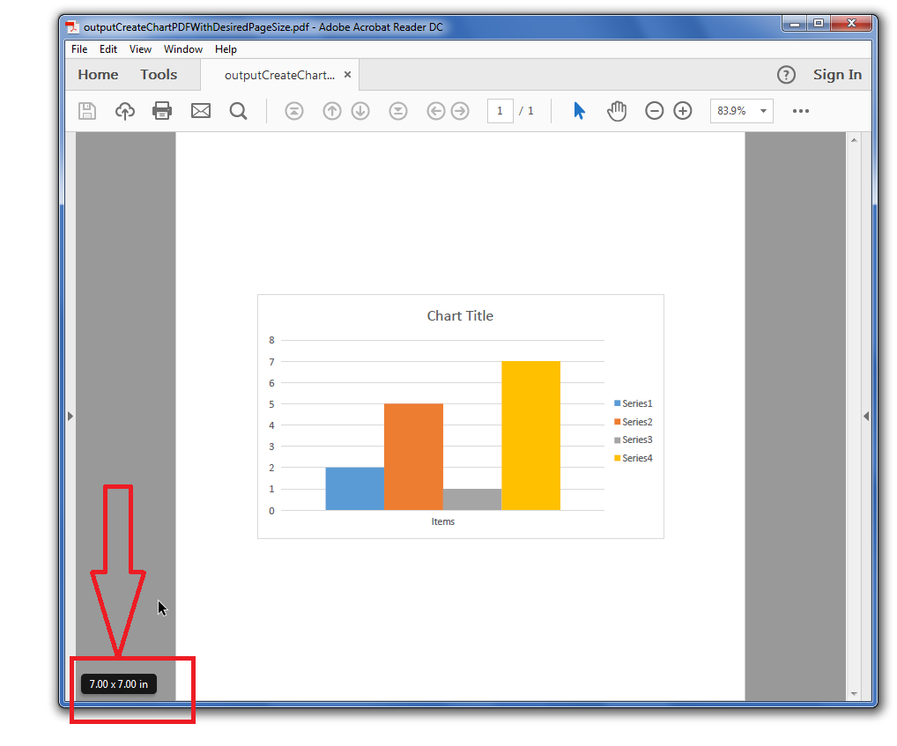

## **Rendering Chart to PDF**

In order to render the chart to PDF format, the Aspose.Cells for Python via .NET APIs have exposed the [**Chart.to_pdf**](https://reference.aspose.com/cells/python-net/aspose.cells.charts/chart/to_pdf) method with the ability to store the resultant PDF on disc path or Stream.



## **Create Chart PDF with Desired Page Size**
You can create chart Pdf with your desired page size using Aspose.Cells for Python via .NET and specify how you want to align the chart inside the page as top, bottom, center, left, right etc. Besides, the output chart can be created in stream or on disk.Please see the following sample code that loads the [sample Excel file](64716906.xlsx), accesses the first chart inside the worksheet and then converts it into [output Pdf](64716907.pdf) with desired page size. The following screenshot shows that the page size in the output Pdf is 7x7 as specified inside the code and chart is center aligned both horizontally as well as vertically. 

## **Sample Code**



