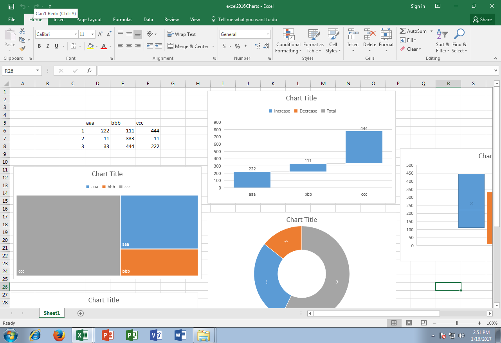

## **Possible Usage Scenarios**
Aspose.Cells for Python via .NET now supports the reading and manipulation of Microsoft Excel 2016 charts which are not present in Microsoft Excel 2013 or earlier versions.

## **Read and Manipulate Excel 2016 Charts**
The following sample code loads the [source Excel file](22774101.xlsx) which contains Excel 2016 charts in the first worksheet. It reads all charts one by one and changes their titles according to their chart types. The following screenshot shows the source Excel file before the code is executed. As you can see, the chart title is the same for all charts.

The following screenshot shows the [output Excel file](22774104.xlsx) after the code is executed. As you can see, the chart title is changed according to its chart type.

## **Sample Code**


## **Console Output**
Here is the console output of the above sample code when executed with the provided [source Excel file](22774101.xlsx).


Waterfall

Treemap

Sunburst

Histogram

BoxWhisker


## **Advanced topics**
- [Creating Waterfall Chart](/cells/python-net/creating-waterfall-chart/)
- [Creating TreeMap Chart](/cells/python-net/creating-treemap-chart/)
- [Creating Sunburst Chart](/cells/python-net/creating-sunburst-chart/)

