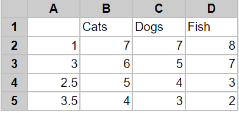

## **Possible Usage Scenarios**
There are different types of X axes. While the Y axis is a Value type axis, the X axis can be a Category type axis or a Value type axis. When using a Value axis, the data is treated as continuously varying numerical data, and the marker is placed at a point along the axis which varies according to its numerical value. When using a Category axis, the data is treated as a sequence of non‑numerical text labels, and the marker is placed at a point along the axis according to its position in the sequence. The sample below illustrates the difference between Value and Category Axes.  
Our sample data is shown in the [sample table file](sample.png) below. The first column contains our X‑axis data, which can be treated as Categories or as Values. Note that the numbers are not equally spaced, nor do they even appear in numerical order.

## **Handle X and Category Axes like Microsoft Excel**
We will display this data on two types of charts: the first chart is an XY (Scatter) chart with X as a Value Axis, and the second chart is a line chart with X as a Category Axis.

## **Sample Code**


