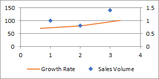

## **Possible Usage Scenarios**
When the numbers in a chart vary widely from data series to data series, or when you have mixed types of data (price and volume), plot one or more data series on a secondary vertical (value) axis. The scale of the secondary vertical axis shows the values for the associated data series. A secondary axis works well in a chart that shows a combination of column and line charts.

## **Handle Primary and Secondary Axis like Microsoft Excel**
Please see the following sample code that creates a new Excel file and puts the values of the chart in the first worksheet.  
Then we add a chart and show the secondary axis.

## **Sample Code**


