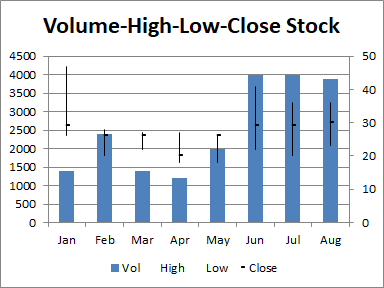

## **Possible Usage Scenarios**
The third stock chart we will look at is the Volume High Low Close chart.  Again it is important to repeat that you must have the data in the correct order.  If you need to rearrange your data table, you should do it before you set up your chart.
This chart include a column for volume immediately after the first (category) column, and the charts include a column chart on the primary axis showing this volume, while the prices are moved to the secondary axis.

## **Volume-High-Low-Close (VHLC) stock chart**

## **Sample Code**
The following sample code loads the [sample Excel file](Volume-High-Low-Close.xlsx) and generates the [output Excel file](out.xlsx).


