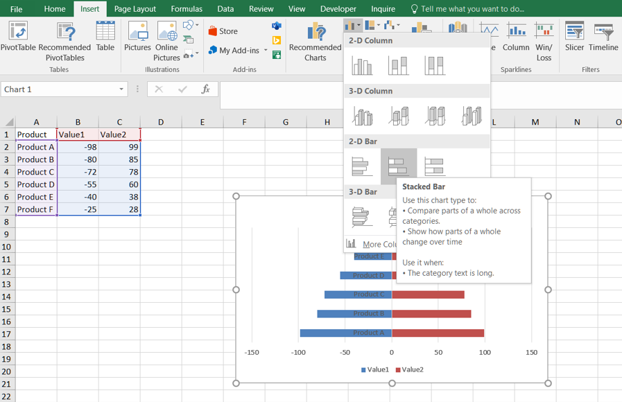
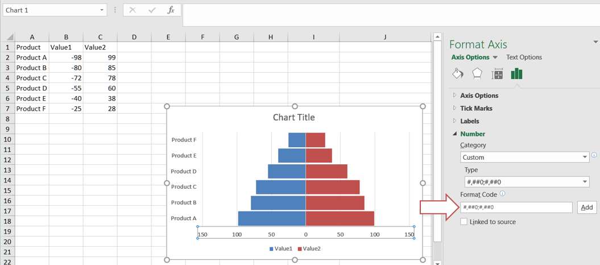

## **Introduction**
A tornado chart, also known as a tornado diagram or tornado graph, is a type of data visualization that is often used for sensitivity analysis in Excel. It helps you understand the impact of changing variables on a particular outcome or result.

## **How to Create a Tornado Chart in Excel**
You can create a tornado chart in Excel by following these steps:
1. Select the data and go to Insert --> Charts --> Insert Column or Bar Chart --> Stacked Bar Chart. Click on it.
 

2. Change the Y-axis: Right-click on the y-axis. Click on the format axis. In labels, click on label position drop-down and select Low item.
 

3. Select any bar and go to formatting. Set an appropriate gap width.
 

4. Let's remove the minus sign (-) from the tornado chart. Select the x-axis. Go to formatting. In the axis options, click on the number. In category, select custom. In format code write ###0,###0. Click on add.
 

5. click on the y-axis and go to the axis options. In the Axis options, check Categories in reverse order.
 

## **How to Add a Tornado Chart in Aspose.Cells for Python Excel Library**
Please see the following sample code. It loads the [sample Excel file](sample.xlsx) that contains some sample data. It then creates the stacked bar chart based on the initial data and sets relevant properties. Finally, it saves the workbook to [output XLSX format](out.xlsx). The following screenshot shows the tornado chart created by Aspose.Cells for Python via .NET in the output Excel file.
 

### **Sample Code**


