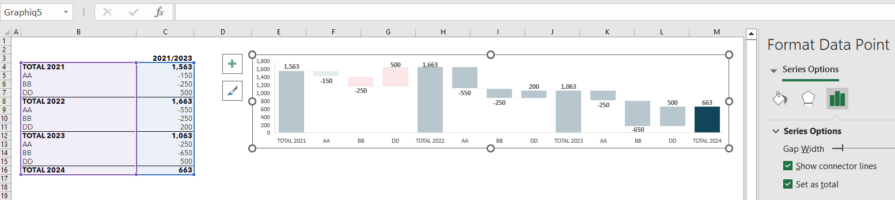

## **What is "Set Point as Total" in Excel Chart**

In some Excel charts like waterfall charts, certain data points represent the cumulative sum of previous values. This article demonstrates how to programmatically configure these total points using Aspose.Cells.

## **Waterfall Chart Requiring Total Points**


This waterfall chart example shows four "Total" data points that should aggregate previous values. The highlighted "Total 2024" point demonstrates an unconfigured total state in the original file. Download the [sample Excel file](SampleSheet.xlsx) to follow along.

## **Configure Total Points with Aspose.Cells for Python**

The following code demonstrates proper total point configuration:

```python
import aspose.cells as cells
from aspose.cells.charts import ChartType

# Load sample workbook
workbook = cells.Workbook("SampleSheet.xlsx")

try:
    # Access first worksheet and chart
    worksheet = workbook.worksheets[0]
    chart = worksheet.charts[0]
    
    # Verify chart type
    if chart.type == ChartType.WATERFALL:
        # Configure chart data range
        chart.set_data_range("A1:B8", True)
        
        # Customize series formatting
        chart.n_series.is_color_varied = True
        
        # Configure total points (0-based indices)
        total_points = [3, 5, 7]  # Points to mark as totals
        for i in total_points:
            point = chart.n_series.points[i]
            point.is_total = True
            
        # Save modified workbook
        workbook.save("output.xlsx")
        
except Exception as e:
    print(f"Error processing workbook: {str(e)}")
```

```python
import os
from aspose.cells import Workbook

file_path = ""
wb = Workbook(os.path.join(file_path, "SampleSheet.xlsx"))
worksheet = wb.worksheets[0]
chart = worksheet.charts.get("Graphiq5")

# Set some points as total column
# In this example, we set points 0, 4, 8, 12 as total
chart.n_series[0].layout_properties.subtotals = [0, 4, 8, 12]
wb.save(os.path.join(file_path, "output.xlsx"))
```

The corrected [output file](output.xlsx) now properly configures total points:



Key implementation details:
- Use 0-based indices for data points
- Set `is_total` property on `ChartPoint` objects
- Ensure proper data range configuration
- Handle chart type validation

See [ChartPoint documentation](https://reference.aspose.com/cells/python-net/aspose.cells.charts/chartpoint/) for advanced configuration options.
