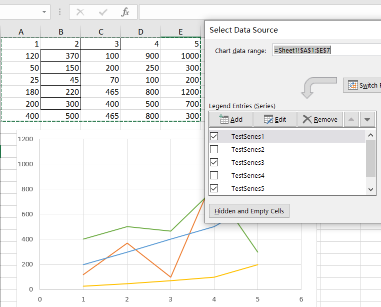

## **How to set series invisible in Excel Chart**

In an Excel chart, you can right-click a chart, click "Select Data", and in the pop-up window, set whether a series is visible by checking or unchecking it.
You can download the following [sample file](SeriesFiltered.xlsx) and operate it in Excel as shown in the figure to achieve this function. Next, we will show you how to accomplish this using the Aspose.Cells for Python via .NET library.



## **How to set series invisible using Aspose.Cells**

Use the following code to set series invisible using Aspose.Cells for Python via .NET:

```python
import os
from aspose.cells import Workbook

current_dir = os.path.dirname(os.path.abspath(__file__))
data_dir = os.path.join(current_dir, "data")

# Load sample workbook
workbook = Workbook(os.path.join(data_dir, "SeriesFiltered.xlsx"))

# Access charts from first worksheet
charts = workbook.worksheets[0].charts
chart = charts.get("Chart 1")

# Get series collections
n_series_filtered = chart.filtered_n_series
n_series = chart.n_series

# Filter series by marking them as filtered
n_series[1].is_filtered = True
n_series[0].is_filtered = True

# Save modified workbook
workbook.save(os.path.join(data_dir, "output.xlsx"))
```

You can get the following [Input file](SeriesFiltered.xlsx) and [output file](output.xlsx).

As shown in the figure below, the first two series which were originally visible have become invisible in the output file.

