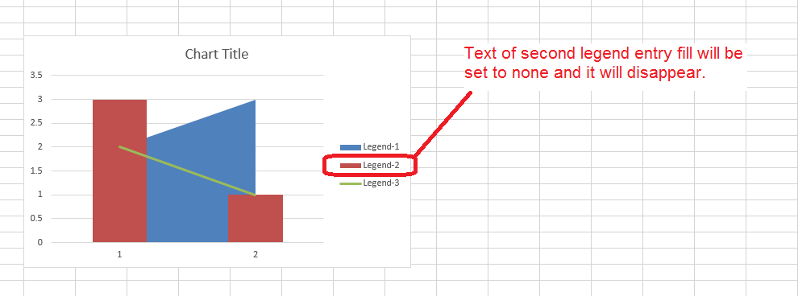

{}

If you want the chart legend entry text fill to be none (so that it is not displayed in the chart legend), set the [**LegendEntry.is_text_no_fill**](https://reference.aspose.com/cells/python-net/aspose.cells.charts/legendentry/is_text_no_fill) property to **true**.

{}

The following sample code sets the fill of the chart's second legend entry text to none. Please download the [sample excel file](5115219.xlsx) used in this code and the [output excel file](5115217.xlsx) generated by it for your reference.

The following screenshot highlights the effect of this code on the [sample excel file](5115219.xlsx).



