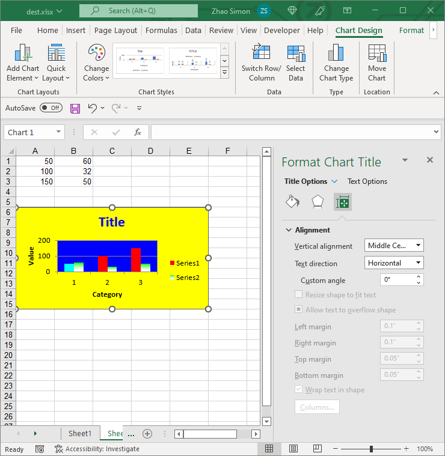

{}

In Excel charts, there are 2 kinds of title:
1. Chart Title 
1. Axis Titles

{}

## **Title Options**
Aspose.Cells for Python via .NET also allows to manage chart's titles at runtime，with [Title](https://reference.aspose.com/cells/python-net/aspose.cells.charts/title/) object, you can change text, font and fill format for titles.

||

## **Setting the Titles of Charts or Axes**
You can use Microsoft Excel to set the titles of a chart and its axes in a WYSIWYG environment. Aspose.Cells for Python via .NET also allows developers to set the titles of a chart and its axes at runtime. All charts and their axes contain a [title](https://reference.aspose.com/cells/python-net/aspose.cells.charts/chart/title) property that can be used to set their titles as shown below in an example.

The following code snippet demonstrates how to set titles to charts and axes.



## **Advance topics**
- [Read Chart Subtitle from ODS File](/cells/python-net/read-chart-subtitle-from-ods-file/)
