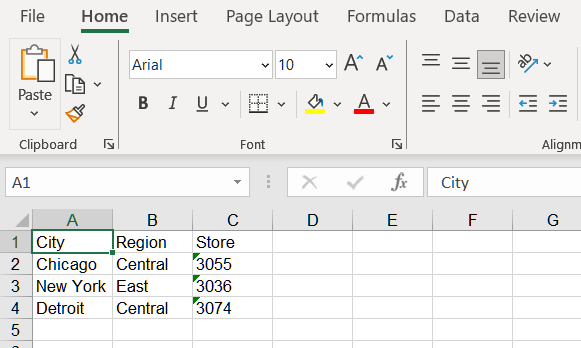
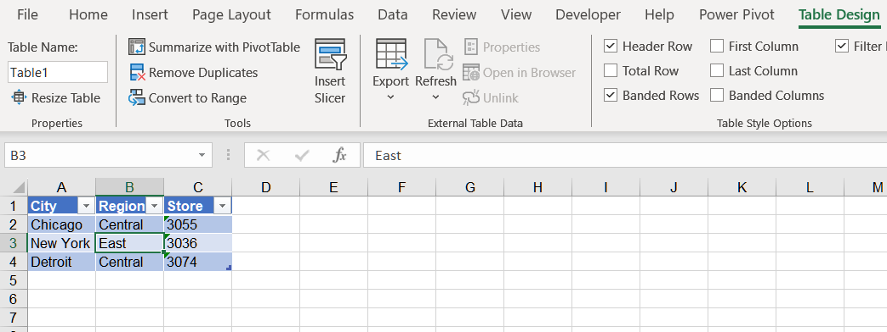
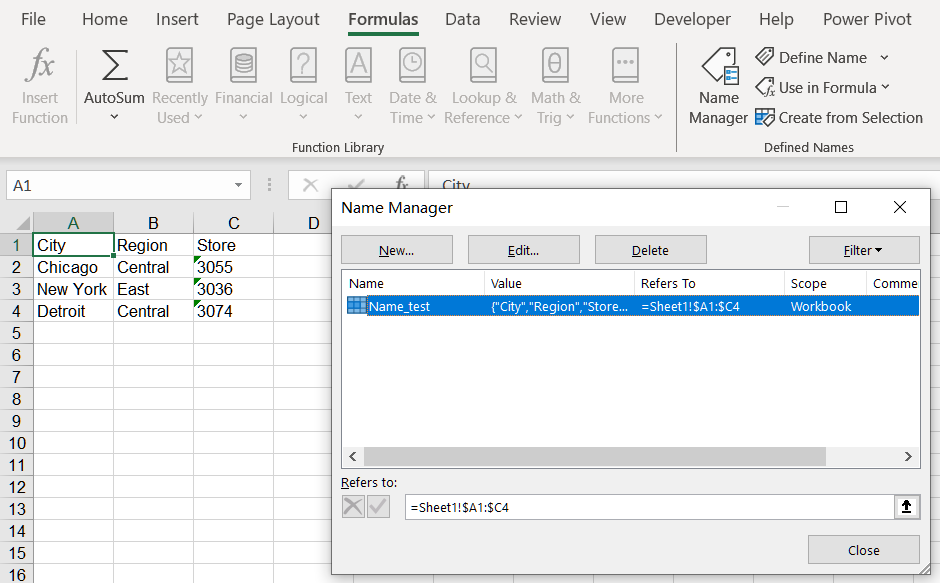

{}

Using Aspose.Cells for Python via .NET API, you can convert NumPy array to Excel , OpenOffice, Pdf, Json and many different formats.


{}

## **How to Convert NumPy ndarray to Excel**
Here's an example code snippet to demonstrate how to import data from a NumPy array to an Excel file using Aspose.Cells for Python via .NET:
1. Create a sample NumPy array data.
1. Traverse NumPy array and import data using Aspose.Cells for Python via .NET.



The output result:
<br>


## **How to Convert NumPy ndarray to ListObject**
Here's an example code snippet to demonstrate how to import data from a NumPy array to a ListObject using Aspose.Cells for Python via .NET:
1. Create a sample NumPy array data.
1. Traverse NumPy array and import data using Aspose.Cells for Python via .NET.
1. Create ListObject object using sample data.



The output result:
<br>


## **How to Convert NumPy ndarray to Range**
Here's an example code snippet to demonstrate how to import data from a NumPy array to a Range using Aspose.Cells for Python via .NET:
1. Create a sample NumPy array data.
1. Traverse NumPy array and import data using Aspose.Cells for Python via .NET.
1. Create Range object using sample data.



The output result:
```
row count: 4
column count: 3
```

## **How to Convert NumPy ndarray to Name**
Here's an example code snippet to demonstrate how to import data from a NumPy array to a Name using Aspose.Cells for Python via .NET:
1. Create a sample NumPy array data.
1. Traverse NumPy array and import data using Aspose.Cells for Python via .NET.
1. Create Name object using sample data.



The output result:
<br>
