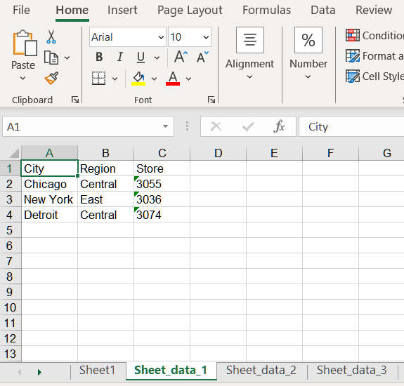

## **Introduction to NumPy**
NumPy (Numerical Python) is an open-source numerical computation extension of Python. This tool can be used to store and process large matrices, which is much more efficient than Python's nested list structure (which can also be used to represent matrices). It supports a large number of dimensional arrays and matrix operations, and also provides a large number of mathematical function libraries for array operations. 

The main functions of NumPy:
1. Ndarray, a multidimensional array object, is a fast, flexible, and space saving data structure.
1. Linear algebra operations, including matrix multiplication, transposition, inversion, etc.
1. Fourier transform, performing a fast Fourier transform on an array.
1. Fast operation of floating-point arrays.
1. Integrate C language code into Python to make it run faster.

Using Aspose.Cells for Python via .NET API, you can convert NumPy ndarray to Excel , OpenOffice, Pdf, Json and many different formats.

## **How to Convert NumPy ndarray to Excel Workbook**
Here's an example code snippet to demonstrate how to import data from a NumPy array to an Excel file using Aspose.Cells for Python via .NET:
1. Create a sample NumPy array data.
1. Traverse NumPy array and import data using Aspose.Cells for Python via .NET.



The output result:
<br>


## **How to Convert NumPy ndarray to Worksheet**
Here's an example code snippet to demonstrate how to import data from a NumPy array to an Excel file using Aspose.Cells for Python via .NET:
1. Create a sample NumPy array data.
1. Traverse NumPy array and import data using Aspose.Cells for Python via .NET.



The output result:
<br>


## **How to Convert NumPy ndarray to ListObject**
Here's an example code snippet to demonstrate how to import data from a NumPy array to a ListObject using Aspose.Cells for Python via .NET:
1. Create a sample NumPy array data.
1. Traverse NumPy array and import data using Aspose.Cells for Python via .NET.
1. Create ListObject object using sample data.



The output result:
<br>


## **How to Convert NumPy ndarray to Range**
Here's an example code snippet to demonstrate how to import data from a NumPy array to a Range using Aspose.Cells for Python via .NET:
1. Create a sample NumPy array data.
1. Traverse NumPy array and import data using Aspose.Cells for Python via .NET.
1. Create Range object using sample data.



The output result:
```
row count: 4
column count: 3
```

## **How to Convert NumPy ndarray to Name**
Here's an example code snippet to demonstrate how to import data from a NumPy array to a Name using Aspose.Cells for Python via .NET:
1. Create a sample NumPy array data.
1. Traverse NumPy array and import data using Aspose.Cells for Python via .NET.
1. Create Name object using sample data.



The output result:
<br>


