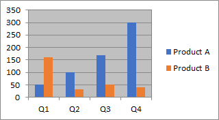

{}

Using Aspose.Cells for Python via .NET API, you can convert pandas DataFrame to Excel , OpenOffice, Pdf, Json and many different formats.

{}

## **Convert Pandas DataFrame to Excel directly**
Here's an example code snippet to demonstrate how to import data from a pandas DataFrame to an Excel file using Aspose.Cells for Python via .NET:
1. Create a sample pandas DataFrame data.
1. Traverse DataFrame and import data using Aspose.Cells for Python via .NET.



## **Convert Pandas DataFrame to XLSX via CSV format**
Converting a pandas DataFrame to CSV is a common operation. Using Aspose.Cells for Python via .NET, we can perform additional processing on the generated CSV file, such as creating charts and saving as an XLSX file. The following code demonstrates this workflow:
1. Create a sample pandas DataFrame data.
1. Convert DataFrame to CSV using pandas.
1. Create charts and save as XLSX with Aspose.Cells for Python via .NET.



## **Convert Pandas DataFrame to Excel via json data**
Here's an example code snippet to demonstrate how to import data from a pandas DataFrame to an Excel file using Aspose.Cells for Python via .NET:
1. Create a sample pandas DataFrame data.
1. Use the pandas library to convert the DataFrame data into JSON data.
1. Import JSON data using Aspose.Cells for Python via .NET.



## **Exporting Multiple Pandas DataFrames to Excel Sheets**
Sometimes, we may also want to insert multiple DataFrames into different worksheets in an [Excel file](MultiDataFrame.xlsx).The following example demonstrates this process.




