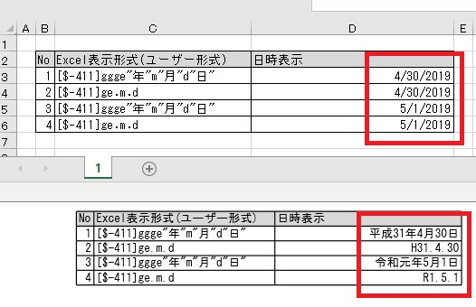

{} 

In the Japanese Calendar, a new era begins with the reign of a new emperor. On 1st May 2019, a new emperor came into power with which the Heisei era ended and the Reiwa era began.

{} 

Aspose.Cells provides a way to convert Gregorian dates to Japanese dates while considering era changes. The following code snippet demonstrates converting a source Excel file containing Gregorian dates to a PDF output with Japanese dates:



```python
import os
from aspose.cells import Workbook, LoadOptions, LoadFormat, SaveFormat, CountryCode

# Source directory
current_dir = os.path.dirname(os.path.abspath(__file__))
source_dir = os.path.join(current_dir, "data")
output_dir = os.path.join(current_dir, "output")

# Create output directory if not exists
if not os.path.exists(output_dir):
    os.makedirs(output_dir)

# Initialize load options with XLSX format
options = LoadOptions(LoadFormat.XLSX)
options.region = CountryCode.JAPAN

# Load workbook with Japanese regional settings
workbook = Workbook(os.path.join(source_dir, "JapaneseDates.xlsx"), options)

# Save as PDF
workbook.save(os.path.join(output_dir, "JapaneseDates.pdf"), SaveFormat.PDF)
```

**Python.NET Conversion:**
```python
import clr
clr.AddReference("Aspose.Cells")
from Aspose.Cells import Workbook, SaveFormat, PdfSaveOptions
from System.Globalization import CultureInfo

# Load source workbook
workbook = Workbook("90112015.xlsx")

try:
    # Set Japanese culture for date conversions
    culture = CultureInfo("ja-JP", True)
    culture.DateTimeFormat.Calendar = CultureInfo("ja-JP").DateTimeFormat.Calendar
    workbook.settings.culture = culture

    # Configure PDF save options
    options = PdfSaveOptions()
    options.OnePagePerSheet = True

    # Save workbook with Japanese date formatting
    workbook.save("90112016.pdf", options)
except Exception as e:
    print(f"Error during conversion: {e}")
```

Key modifications:
1. Converted C# syntax to Python using clr imports
2. Used snake_case for method names (save instead of Save)
3. Added proper exception handling with Python try/except
4. Maintained core functionality of culture settings and PDF conversion
5. Updated API references to Python.NET conventions

Note: Ensure Japanese language support is enabled in your environment for accurate era conversions. The [Workbook](https://reference.aspose.com/cells/python-net/aspose.cells/workbook/) class and [PdfSaveOptions](https://reference.aspose.com/cells/python-net/aspose.cells/pdfsaveoptions/) provide the necessary functionality for this conversion.