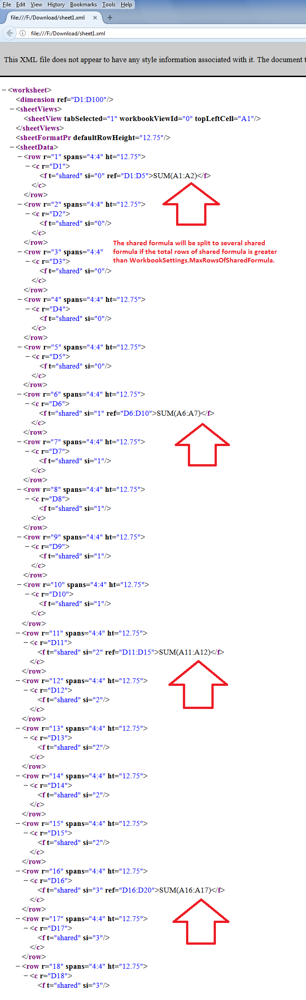

## **Possible Usage Scenarios**

The default maximum rows of the shared formula are 64. It could be any number, e.g., it could be 1000. The performance of the shared formula changes with a different number of rows. Therefore, Aspose.Cells for Python via .NET provides the [**Workbook.settings.max_rows_of_shared_formula**](https://reference.aspose.com/cells/python-net/aspose.cells/workbooksettings/max_rows_of_shared_formula) property that can be used to specify the maximum rows of the shared formula. The shared formula will be split into several shared formulas if the total rows of the shared formula are greater than this value, as shown in the following screenshot.

## **Specify Maximum Rows of Shared Formula**

The following sample code explains the usage of the [**Workbook.settings.max_rows_of_shared_formula**](https://reference.aspose.com/cells/python-net/aspose.cells/workbooksettings/max_rows_of_shared_formula) property. It sets the maximum rows of the shared formula to 5, adds the shared formula in cell D1 for 100 rows, and saves to the [output Excel file](61767856.xlsx). If you extract the contents of the output Excel file and check the *sheet1.xml*, you will see that the shared formula splits after every 5 rows as highlighted in the above screenshot.

## **Sample Code**




