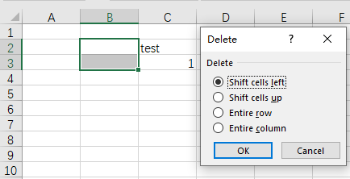

## **Introduction**

In Excel, you can select a range, then delete it and shift other data left or up.

****

## **Delete Ranges Using Aspose.Cells**

Aspose.Cells provides [Cells.delete_range](https://reference.aspose.com/cells/python-net/aspose.cells/cells/delete_range/) method to delete a range.

## **Delete Ranges And Shift Cells Left**

Delete a ranage and shift cells left as the following codes with Aspose.Cells:



## **Delete Ranges And Shift Cells Up**

Delete a ranage and shift cells up as the following codes with Aspose.Cells:



