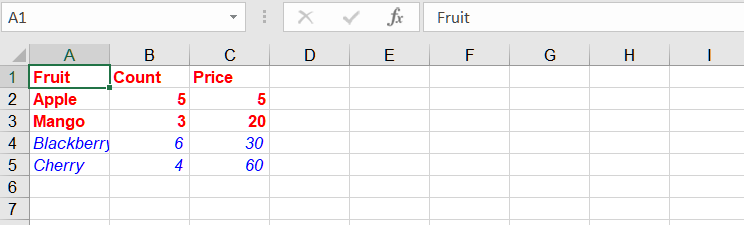

## **Possible Usage Scenarios**
When you need to apply a style to a range, you can use range formatting.

## **How to format a Range in Excel**

To format a range of cells in Excel, you can use the built‑in formatting options provided by Excel. Here's how you can format a range of cells directly in Excel:

1. Open Excel and open the workbook that contains the range you want to format.

2. Select the range of cells you want to format. You can click and drag to select the range, or you can use keyboard shortcuts like **Shift + Arrow keys** to extend the selection.

3. Once the range is selected, right‑click on the selected range and choose **"Format Cells"** from the context menu. Alternatively, you can go to the **Home** tab in the Excel ribbon, click on the **"Format"** dropdown in the **"Cells"** group, and select **"Format Cells"**.

4. The **"Format Cells"** dialog box will appear. Here, you can choose various formatting options to apply to the selected range. For example, you can change the font style, font size, font color, number format, borders, background color, etc. Explore the different tabs in the dialog box to access various formatting options.

5. After making the desired formatting changes, click the **"OK"** button to apply the formatting to the selected range.

## **How to format a Range Using Python**

To format a range using Aspose.Cells, you can use the following methods:
1. [Range.apply_style(style, flag)](https://reference.aspose.com/cells/python-net/aspose.cells/range/apply_style/#aspose.cells.Style-aspose.cells.StyleFlag)  
2. [Range.set_style(style)](https://reference.aspose.com/cells/python-net/aspose.cells/range/set_style/#aspose.cells.Style)  
3. [Range.set_style(style, explicit_flag)](https://reference.aspose.com/cells/python-net/aspose.cells/range/set_style/#aspose.cells.Style-bool)

## **Sample Code**
In this example, we create an Excel workbook, add some sample data, access the first worksheet, and define two ranges ("A1:C3" and "A4:C5"). Then, we create new styles, set various formatting options (e.g., font color, bold), and apply the styles to the ranges. Finally, we save the workbook to a new file.



