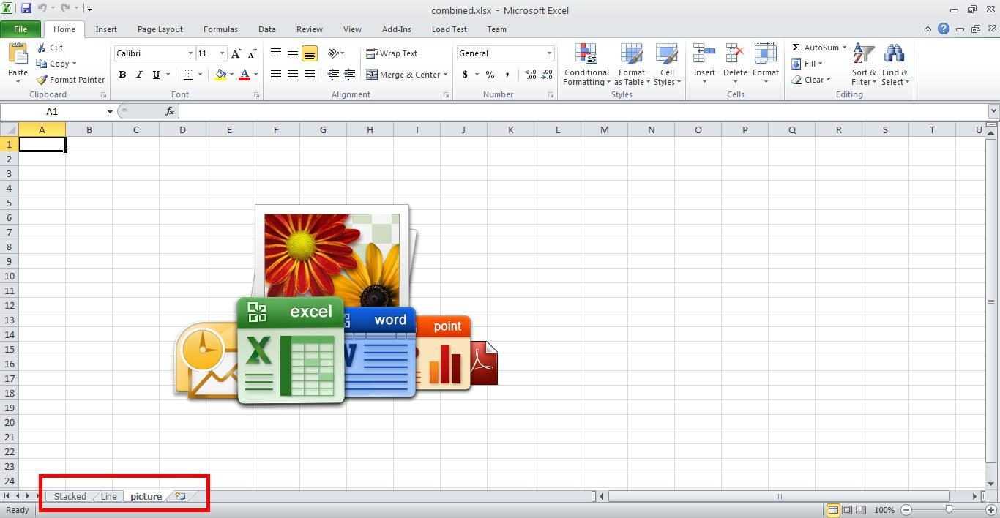

{}

Sometimes, you need to combine workbooks with various content like images, charts, and data into a single workbook. Aspose.Cells for Python via .NET supports this feature. This article shows how to create a console application in Visual Studio and combine workbooks with a few simple lines of code using Aspose.Cells for Python via .NET.

{}

## **Combining Workbooks with Images and Charts**

The example code combines two workbooks into a single workbook using Aspose.Cells for Python via .NET. The code loads the source workbooks, uses the [**Workbook.combine()**](https://reference.aspose.com/cells/python-net/aspose.cells/workbook/combine) method to combine them, and saves the output workbook.

### **Source Workbooks**

- [charts.xlsx](5473097.xlsx)
- [picture.xlsx](5473096.xlsx)

### **Output Workbooks**

- [combined.xlsx](5473095.xlsx)

### **Screenshots**

Below are screenshots of the source and output workbooks.

{}

You can use any source workbooks. These images are provided for illustration purposes.

{}

**The first worksheet of the charts workbook – stacked** 

**Second worksheet of the charts workbook – line** 

**First worksheet of the picture workbook – picture** 

**All three worksheets in the combined workbook – stacked, line, picture** 



## **Advanced topics**
- [Combine Multiple Worksheets into a Single Worksheet](/cells/python-net/combine-multiple-worksheets-into-a-single-worksheet/)
- [Merge Files](/cells/python-net/merge-files/)


