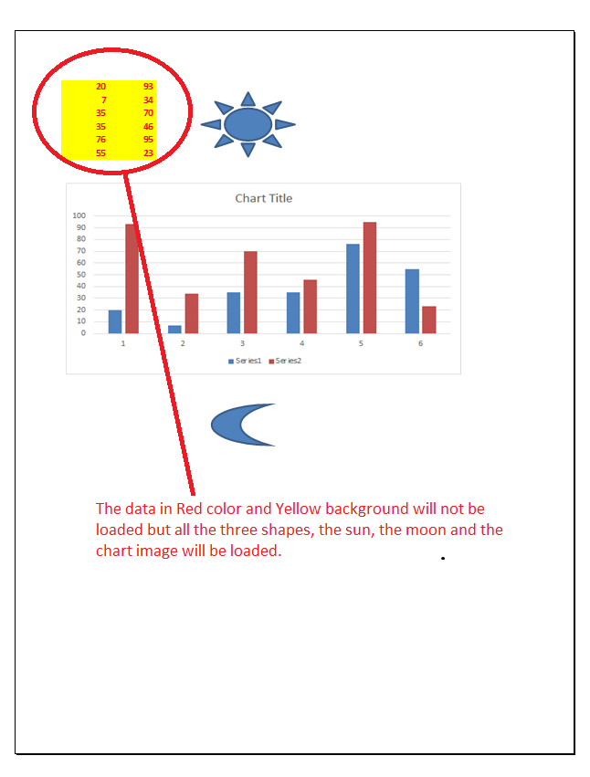

{}

Sometimes, you want to specify which kind of data should be loaded when building the workbook from the template file. Filtering loaded data can improve the performance for your special purpose. Please use the [**LoadOptions.load_filter**](https://reference.aspose.com/cells/python-net/aspose.cells/loadoptions/load_filter) property for this purpose.

{}

The following sample code loads only shape objects while loading the workbook from the [template file](5115552.xlsx) which you can download from the given link. The following screenshot shows the [template file](5115552.xlsx) contents and also explains that the data in Red color and Yellow background will not be loaded because [**LoadOptions.load_filter**](https://reference.aspose.com/cells/python-net/aspose.cells/loadoptions/load_filter) property has been set to [**LoadDataFilterOptions.SHAPE**](https://reference.aspose.com/cells/python-net/aspose.cells/loaddatafilteroptions/)

The following screenshot shows the [output PDF](5115555.pdf) which you can download from the given link. Here you can see, the data in Red color and Yellow background is not present but all shapes are there.




