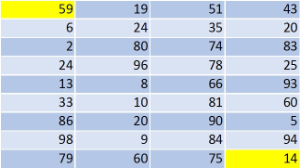

## **Possible Usage Scenarios**

You can make an image of a worksheet using Aspose.Cells for Python via .NET. However, sometimes you need to export only a range of cells in a worksheet to an image. This article explains how to achieve this.

## **Export Range of Cells in a Worksheet to Image**

To take an image of a range, set the print area to the desired range and then set all margins to 0. Also set [**ImageOrPrintOptions.one_page_per_sheet**](https://reference.aspose.com/cells/python-net/aspose.cells.rendering/imageorprintoptions/one_page_per_sheet) to **true**. The following code takes an image of the range D8:G16. Below is a screenshot of the [sample Excel file](47153160.xlsx) used in the code. You can try the code with any Excel file.

## **Screenshot of Sample Excel File and its Exported Image**

****

Executing the code creates an image of the range D8:G16 only.

****

## **Sample Code**



