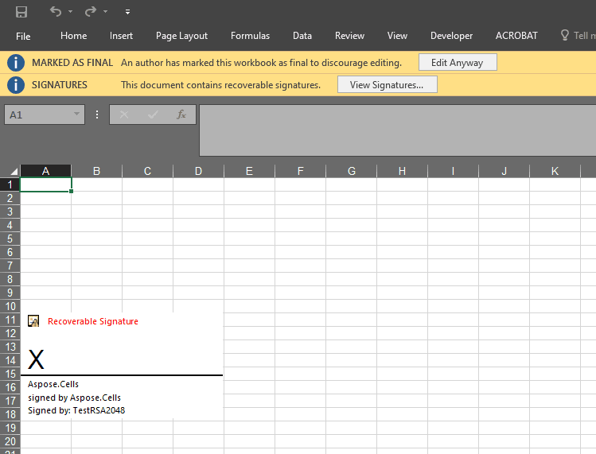

## **Introduction**

Aspose.Cells for Python via .NET provides the [**Picture.signature_line**](https://reference.aspose.com/cells/python-net/aspose.cells.drawing/picture/signature_line) property to add the signature line of the worksheet.

## **How to Add Signature Line to Worksheet**

The following sample code demonstrated how to make use of [**Picture.signature_line**](https://reference.aspose.com/cells/python-net/aspose.cells.drawing/picture/signature_line) property to add the signature line of the worksheet. The screenshot shows the effect of the sample code on the sample Excel file after execution.

## **Sample Code**



