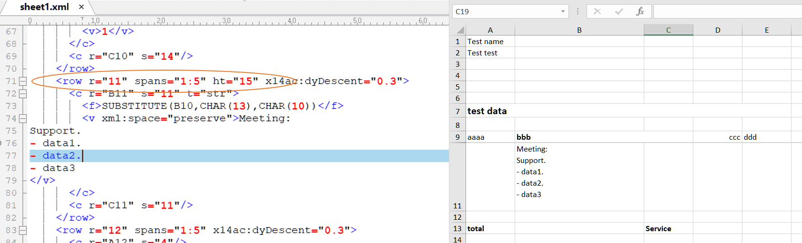

## **Possible Usage Scenarios**
The height of the row automatically matches the font of the content, but when the height of the cached row does not match the height of the content in the file, MS Excel will automatically adjust the row height when loading the file, while Aspose.Cells for Python via .NET will not automatically adjust it to improve performance. If you need to use the Aspose.Cells for Python via .NET program to automatically match line heights when loading files, you can achieve the goal through the parameter [LoadOptions.AutoFitterOptions.only_auto](https://reference.aspose.com/cells/python-net/aspose.cells/autofitteroptions/only_auto/).

Please refer to the following image data. We can observe that the cache row height in line 11 is 15, but Excel automatically adjusted the row height when loading the file.
 

## **Adjust Row Height using Aspose.Cells for Python Excel Library**
If you directly load the file and save it to PDF, the data will not be fully displayed in PDF because its cache line height is only 15.
 

 
If you set the parameter [LoadOptions.AutoFitterOptions.only_auto](https://reference.aspose.com/cells/python-net/aspose.cells/autofitteroptions/only_auto/) to true when loading the file, then Aspose.Cells for Python via .NET will automatically adjust the row height. The adjusted line height can effectively meet the text display requirements.
 

## **Python Sample Code**



