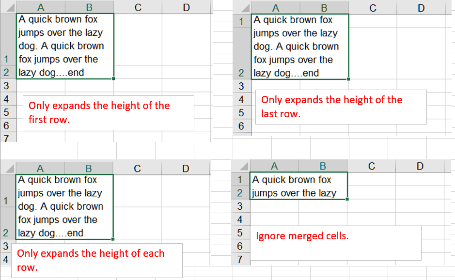

{}

Microsoft Excel provides a feature that allows you to auto-size the height of a cell according to its content. The feature is called auto-fit rows. Microsoft Excel doesn't set auto-fit operation on merged cells natively. Sometimes the feature becomes vital for a user who really needs to implement auto-fit rows on merged cells too.

{}

## **How to use AutoFitMergedCellsType for autofitting rows**
Aspose.Cells for Python via .NET supports this feature through the [**AutoFitterOptions.AutoFitMergedCellsType**](https://reference.aspose.com/cells/python-net/aspose.cells/autofitmergedcellstype/) API. Using this API, it is possible to auto-fit rows in a worksheet including merged cells. Here is a list of all possible types of auto fitting merged cells:

- NONE
- FIRST_LINE
- LAST_LINE
- EACH_LINE

## **Autofit Rows for Merged Cells**

Please see the following code, it creates a workbook object and add multiple worksheets. Use different methods for autofit operations in each worksheet. The screenshot shows the results after the execution of the sample code.

 

## **C# Sample Code**


