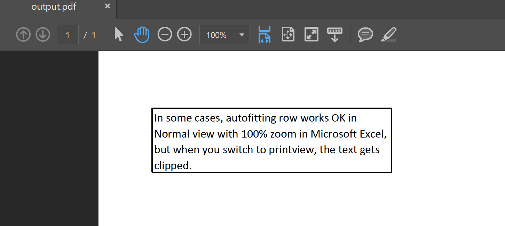

Generally, when you want to display all the text in a cell, you can autofit row in Normal view with 100% zoom in Microsoft Excel. This allows the text to be fully visible in Normal view, and even when you print or save the file as a PDF, the text will be displayed correctly.

However, in some cases, autofitting row works fine in Normal view, but when you switch to print view or save the file as a PDF, the text gets clipped. Please check the source file [Book1.xlsx](Book1.xlsx) and screenshots.

If you want to prevent text being clipped in the saved PDF file, you can autofit row with the [AutoFitterOptions.for_rendering](https://reference.aspose.com/cells/python-net/aspose.cells/autofitteroptions/for_rendering/) option.



Now, the text is not clipped in the output PDF file.

