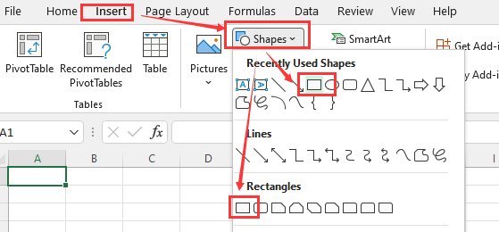
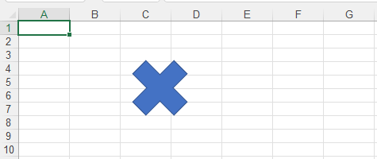
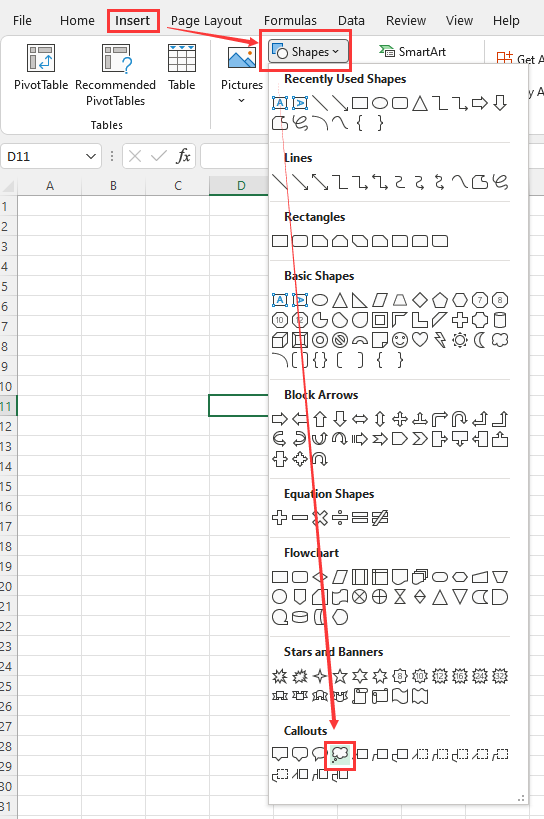

{}

Sometimes you need to insert some necessary shapes into the worksheet.You may need to insert the same shape in different positions of the worksheet.Or you need to batch insert shapes in the worksheet.

Do not worry! [Aspose.Cells](https://products.aspose.com/cells/) supports all these operations.

{}

The shapes in excel are mainly divided into the following types:
- **Pictures**
- **OleObjects**
- **Lines**
- **Rectangles**
- **Basic Shapes**
- **Block Arrows**
- **Equation Shapes**
- **FlowCharts**
- **Stars and Banners**
- **Callouts**

This guide document will select one or two shapes from each type to make samples.Through these examples, you will learn how to use [Aspose.Cells](https://products.aspose.com/cells/) to insert the specified shape into the worksheet.

## **Adding Pictures in Excel Worksheet in C#**

Adding pictures to a spreadsheet is very easy. It only takes a few lines of code:
Simply call the [**add**](https://reference.aspose.com/cells/python-net/aspose.cells.drawing/picturecollection/add) method of the [**pictures**](https://reference.aspose.com/cells/python-net/aspose.cells.drawing/picturecollection) collection (encapsulated in the [**Worksheet**](https://reference.aspose.com/cells/python-net/aspose.cells/worksheet) object). The [**add**](https://reference.aspose.com/cells/python-net/aspose.cells.drawing/picturecollection/add) method takes the following parameters:

- **upper_left_row**, the index of the upper left row.
- **upper_left_column**, the index of the upper left column.
- **file_name**, the name of the image file, complete with path.



## **Inserting OLE Objects into Excel Worksheet in C#**

Aspose.Cells for Python via .NET supports adding, extracting and manipulating OLE objects in worksheets. For this reason, Aspose.Cells for Python via .NET has the [**OleObjectCollection**](https://reference.aspose.com/cells/python-net/aspose.cells.drawing/oleobjectcollection) class, used to add a new OLE Object to the collection list. Another class, [**OleObject**](https://reference.aspose.com/cells/python-net/aspose.cells.drawing/oleobject), represents an OLE Object. It has some important members:

- The [**image_data**](https://reference.aspose.com/cells/python-net/aspose.cells.drawing/oleobject/image_data) property specifies the image (icon) data of byte array type. The image will be displayed to show the OLE Object in the worksheet.
- The [**object_data**](https://reference.aspose.com/cells/python-net/aspose.cells.drawing/oleobject/object_data) property specifies the object data in the form of a byte array. This data will be shown in its related program when you double-click on the OLE Object icon.

The following example shows how to add an OLE Object(s) into a worksheet.



## **Inserting a Line to Excel Worksheet in C#**

The shape of line belongs to the **lines** category.

***In Microsoft Excel (for example 2007):***

- Select the cell where you want to insert the line
- Click the Insert menu and click Shapes.
- Then,select the line from 'Recently Used Shapes' or 'Lines'

***Using Aspose.Cells for Python via .NET***

You can use the following method to insert a line in the worksheet.

{}

[**add_line**](https://reference.aspose.com/cells/python-net/aspose.cells.drawing/shapecollection/add_line)

The method returns a [LineShape](https://reference.aspose.com/cells/python-net/aspose.cells.drawing/lineshape) object.

{}

The following example shows how to insert line to a worksheet.



Execute the above code, you will get the following results:

## **Inserting a line arrow to Excel Worksheet in C#**

The shape of line arrow belongs to the **Lines** category.It is a special case of line.

***In Microsoft Excel (for example 2007):***

- Select the cell where you want to insert the line arrow
- Click the Insert menu and click Shapes.
- Then,select the line arrow from 'Recently Used Shapes' or 'Lines'

***Using Aspose.Cells for Python via .NET***

You can use the following method to insert a line arrow in the worksheet.

{}

[**add_line**](https://reference.aspose.com/cells/python-net/aspose.cells.drawing/shapecollection/add_line)

The method returns a [LineShape](https://reference.aspose.com/cells/python-net/aspose.cells.drawing/lineshape) object.

{}

The following example shows how to insert line arrow to a worksheet.



Execute the above code, you will get the following results:

## **Inserting a Rectangle to Excel Worksheet in C#**

The shape of rectangle belongs to the **Rectangles** category.

***In Microsoft Excel (for example 2007):***

- Select the cell where you want to insert the rectangle
- Click the Insert menu and click Shapes.
- Then,select the rectangle from 'Recently Used Shapes' or 'Rectangles'

***Using Aspose.Cells for Python via .NET***

You can use the following method to insert a rectangle in the worksheet.

{}

[**add_rectangle**](https://reference.aspose.com/cells/python-net/aspose.cells.drawing/shapecollection/add_rectangle)

The method returns a [RectangleShape](https://reference.aspose.com/cells/python-net/aspose.cells.drawing/rectangleshape) object.

{}

The following example shows how to insert rectangle to a worksheet.



Execute the above code, you will get the following results:

## **Inserting a Cube to Excel Worksheet in C#**

The shape of cube belongs to the **Basic Shapes** category.

***In Microsoft Excel (for example 2007):***

- Select the cell where you want to insert the cube
- Click the Insert menu and click Shapes.
- Then,select the Cube from **Basic Shapes**

***Using Aspose.Cells for Python via .NET***

You can use the following method to insert a cube in the worksheet.

{}

[**public Shape add_auto_shape(type, upper_left_row, top, upper_left_column, left, height, width)**](https://reference.aspose.com/cells/python-net/aspose.cells.drawing/shapecollection/add_auto_shape)

The method returns a [Shape](https://reference.aspose.com/cells/python-net/aspose.cells.drawing/shape) object.

{}

The following example shows how to insert cube to a worksheet.



Execute the above code, you will get the following results:

## **Inserting a callout quad arrow to Excel Worksheet in C#**

The shape of callout quad arrow belongs to the **Block Arrows** category.

***In Microsoft Excel (for example 2007):***

- Select the cell where you want to insert the callout quad arrow
- Click the Insert menu and click Shapes.
- Then,select the callout quad arrow from **Block Arrows**

***Using Aspose.Cells for Python via .NET***

You can use the following method to insert a callout quad arrow in the worksheet.

{}

[**add_auto_shape**](https://reference.aspose.com/cells/python-net/aspose.cells.drawing/shapecollection/add_auto_shape)

The method returns a [Shape](https://reference.aspose.com/cells/python-net/aspose.cells.drawing/shape) object.

{}

The following example shows how to insert callout quad arrow to a worksheet.



Execute the above code, you will get the following results:

## **Inserting a multiplication sign to Excel Worksheet in C#**

The shape of multiplication sign belongs to the **Equation Shapes** category.

***In Microsoft Excel (for example 2007):***

- Select the cell where you want to insert the multiplication sign
- Click the Insert menu and click Shapes.
- Then,select the multiplication sign from **Equation Shapes**

***Using Aspose.Cells for Python via .NET***

You can use the following method to insert a multiplication sign in the worksheet.

{}

[**add_auto_shape**](https://reference.aspose.com/cells/python-net/aspose.cells.drawing/shapecollection/add_auto_shape)

The method returns a [Shape](https://reference.aspose.com/cells/python-net/aspose.cells.drawing/shape) object.

{}

The following example shows how to insert multiplication sign to a worksheet.



Execute the above code, you will get the following results:

## **Inserting a multidocument to Excel Worksheet in C#**

The shape of multidocument belongs to the **FlowCharts** category.

***In Microsoft Excel (for example 2007):***

- Select the cell where you want to insert the multidocument
- Click the Insert menu and click Shapes.
- Then,select the multidocument from **FlowCharts**

***Using Aspose.Cells for Python via .NET***

You can use the following method to insert a multidocument in the worksheet.

{}

[**add_auto_shape**](https://reference.aspose.com/cells/python-net/aspose.cells.drawing/shapecollection/add_auto_shape)

The method returns a [Shape](https://reference.aspose.com/cells/python-net/aspose.cells.drawing/shape) object.

{}

The following example shows how to insert multidocument to a worksheet.



Execute the above code, you will get the following results:

## **Inserting a Five-pointed star to Excel Worksheet in C#**

The shape of Five-pointed star belongs to the **Stars and Banners** category.

***In Microsoft Excel (for example 2007):***

- Select the cell where you want to insert the Five-pointed star
- Click the Insert menu and click Shapes.
- Then,select the Five-pointed star from **Stars and Banners**

***Using Aspose.Cells for Python via .NET***

You can use the following method to insert a Five-pointed star in the worksheet.

{}

[**add_auto_shape**](https://reference.aspose.com/cells/python-net/aspose.cells.drawing/shapecollection/add_auto_shape)

The method returns a [Shape](https://reference.aspose.com/cells/python-net/aspose.cells.drawing/shape) object.

{}

The following example shows how to insert Five-pointed star to a worksheet.



Execute the above code, you will get the following results:

## **Inserting a thought bubble cloud to Excel Worksheet in C#**

The shape of thought bubble cloud belongs to the **Callouts** category.

***In Microsoft Excel (for example 2007):***

- Select the cell where you want to insert the thought bubble cloud
- Click the Insert menu and click Shapes.
- Then,select the thought bubble cloud from **Callouts**

***Using Aspose.Cells for Python via .NET***

You can use the following method to insert a thought bubble cloud in the worksheet.

{}

[**add_auto_shape**](https://reference.aspose.com/cells/python-net/aspose.cells.drawing/shapecollection/add_auto_shape)

The method returns a [Shape](https://reference.aspose.com/cells/python-net/aspose.cells.drawing/shape) object.

{}

The following example shows how to insert thought bubble cloud to a worksheet.



Execute the above code, you will get the following results:

## **Advance topics**
- [Change Adjustment Values of the Shape](/cells/python-net/change-adjustment-values-of-the-shape/)
- [Copy Shapes between Worksheets](/cells/python-net/copy-shapes-between-worksheets/)
- [Data in Non-Primitive Shape](/cells/python-net/data-in-non-primitive-shape/)
- [Finding Absolute Position of Shape inside the Worksheet](/cells/python-net/finding-absolute-position-of-shape-inside-the-worksheet/)
- [Get Connection points from shape](/cells/python-net/get-connection-points-from-shape/)
- [Managing Controls](/cells/python-net/managing-controls/)
- [Add Icons to Worksheet](/cells/python-net/insert-svg-to-excel/)
- [Managing OLE Objects](/cells/python-net/managing-ole-objects/)
- [Managing Pictures](/cells/python-net/managing-pictures/)
- [Manage Smart Art](/cells/python-net/managing-smartart/)
- [Managing TextBox](/cells/python-net/managing-textbox-of-excel/)
- [Add WordArt Watermark to Worksheet](/cells/python-net/add-wordart-watermark-to-worksheet/)
- [Refresh Values of Linked Shapes](/cells/python-net/refresh-values-of-linked-shapes/)
- [Send Shape Front or Back inside the Worksheet](/cells/python-net/send-shape-front-or-back-inside-the-worksheet/)
- [Manage Shape Options](/cells/python-net/managing-shape-options/)
- [Manage Shape Text Options](/cells/python-net/managing-shape-text-options/)
- [Web Extensions - Office Add-ins](/cells/python-net/web-extensions-office-add-ins/)

