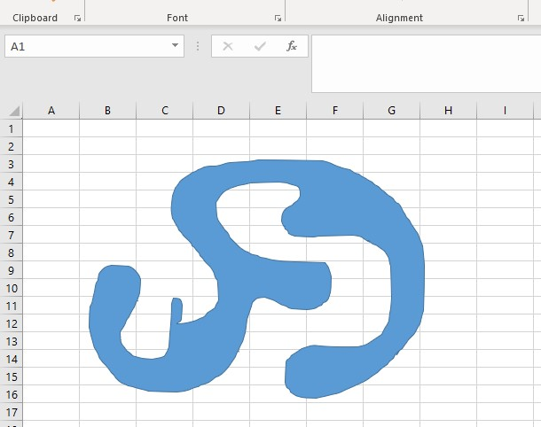

---  
title: Data in Non-Primitive Shape  
type: docs  
weight: 300  
url: /python-net/data-in-non-primitive-shape/  
description: This article shows how to work with data in non‑primitive shapes using the Aspose.Cells for Python via .NET API.  
keywords: Python Excel Library, Python Data in Non-Primitive Shape, Python How to Access Data of Non-Primitive Shape.  
ai_search_scope: cells_pythonnet  
ai_search_endpoint: "https://docsearch.api.aspose.cloud/ask" 
---  

## **Accessing Data of Non-Primitive Shape**  

Sometimes, you need to access data from a shape that is not built‑in. Built‑in shapes are called primitive shapes; ones that aren't are called non‑primitive. For example, you can define your own shapes using various curve‑connected lines.  

## **A Non-Primitive Shape**  

In Aspose.Cells for Python via .NET, non‑primitive shapes are assigned the type [**AutoShapeType.NOT_PRIMITIVE**](https://reference.aspose.com/cells/python-net/aspose.cells.drawing/autoshapetype). You can check their type using the [**Shape.auto_shape_type**](https://reference.aspose.com/cells/python-net/aspose.cells.drawing/shape/auto_shape_type) property.  

Access the shape data using the [**Shape.paths**](https://reference.aspose.com/cells/python-net/aspose.cells.drawing/shape/paths) property. It returns all the connected paths that comprise the non‑primitive shape. These paths are of type [**ShapePath**](https://reference.aspose.com/cells/python-net/aspose.cells.drawing/shapepath), which holds a list of all the segments that, in turn, contain the points for each segment.  

|**Shows an example of a non-primitive shape**|  
| :- |  
||  

  

