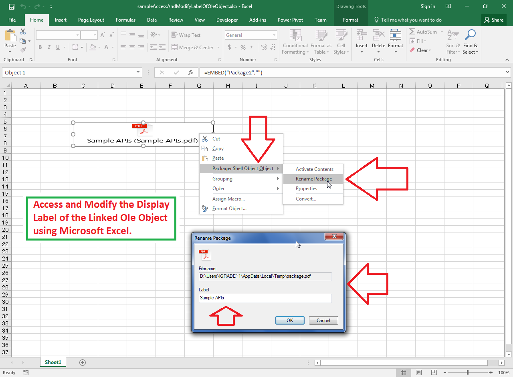

## **Possible Usage Scenarios**

Microsoft Excel allows you to change the display label of the OLE object as shown in the following screenshot. You can also access or modify the display label of the OLE object using Aspose.Cells for Python via .NET APIs with the [**OleObject.Label**](https://reference.aspose.com/cells/python-net/aspose.cells.drawing/oleobject/label) property.

## **Access and Modify the Display Label of the Linked Ole Object**

Please see the following sample code; it loads the sample Excel file that contains the OLE object. The code accesses the OLE object and changes its label from **Sample APIs** to **Aspose APIs**. See the console output below, which shows the effect of the sample code on the sample Excel file as a reference.

## **Sample Code**



## **Console Output**



Ole Object Label - Before: Sample APIs

Ole Object Label - After: Aspose APIs



