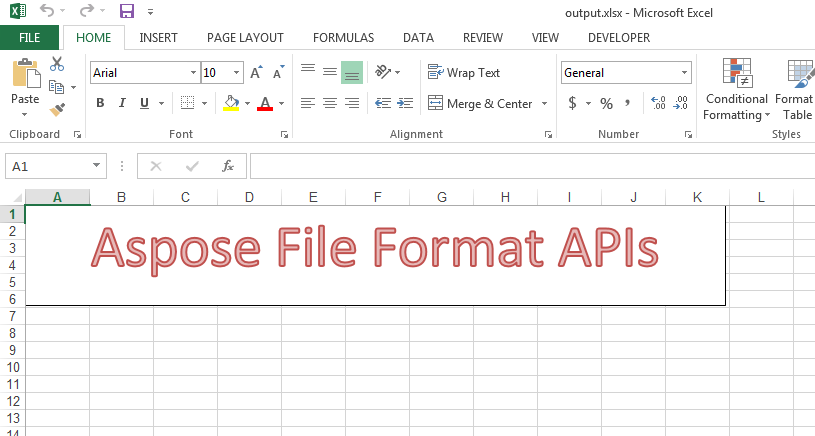

## **Possible Usage Scenarios**
You can set preset WordArt style to the text of the shape using Aspose.Cells for Python via .NET. Please use [FontSetting.set_word_art_style()](https://reference.aspose.com/cells/python-net/aspose.cells/fontsetting/set_word_art_style/#aspose.cells.drawing.PresetWordArtStyle) or [FontSettingCollection.set_word_art_style()](https://reference.aspose.com/cells/python-net/aspose.cells.drawing.texts/fontsettingcollection/set_word_art_style/#aspose.cells.drawing.PresetWordArtStyle) methods for this purpose.

## **Set preset WordArt style to the text of the shape**
The following sample code creates a text box with some text and then sets preset WordArt style of its text using [FontSetting.set_word_art_style()](https://reference.aspose.com/cells/python-net/aspose.cells/fontsetting/set_word_art_style/#aspose.cells.drawing.PresetWordArtStyle) method. This is how the [output excel file](5115445.xlsx) looks in Microsoft Excel.


