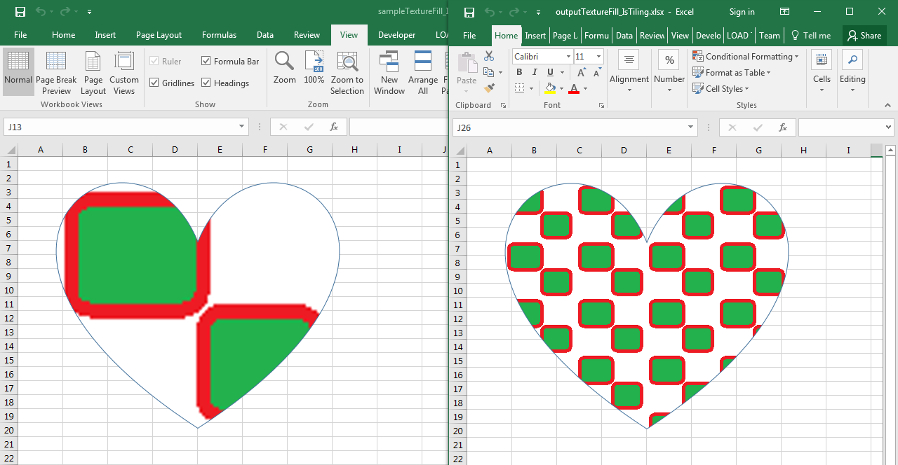

## **Possible Usage Scenarios**

When the picture is small and does not cover the entire surface of the shape without losing its quality, then you have the option to tile it. Tiling fills the shape surface with a small image by repeating them as if they are tiles.

## **Tile Picture as a Texture inside the Shape**

You can fill the shape surface with some image and tile it using the [**Shape.fill.texture_fill.is_tiling**](https://reference.aspose.com/cells/python-net/aspose.cells.drawing/texturefill/is_tiling) property and setting it **true**. Please see the following sample code, its [sample Excel file](46465050.xlsx) as well as the screenshot for a reference.

## **Screenshot**

## **Sample Code**



