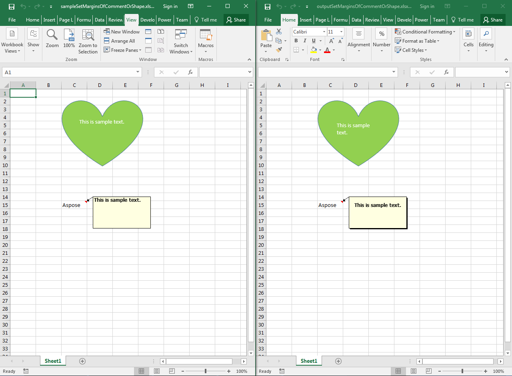

## **Possible Usage Scenarios**

Aspose.Cells for Python through .NET allows you to set the margins of any shape or comment using the [**Shape.text_body.text_alignment**](https://reference.aspose.com/cells/python-net/aspose.cells.drawing.texts/fontsettingcollection/text_alignment) property. This property returns an object of the [**ShapeTextAlignment**](https://reference.aspose.com/cells/python-net/aspose.cells.drawing.texts/shapetextalignment) class, which has several properties, e.g., [**top_margin_pt**](https://reference.aspose.com/cells/python-net/aspose.cells.drawing.texts/shapetextalignment/top_margin_pt), [**left_margin_pt**](https://reference.aspose.com/cells/python-net/aspose.cells.drawing.texts/shapetextalignment/left_margin_pt), [**bottom_margin_pt**](https://reference.aspose.com/cells/python-net/aspose.cells.drawing.texts/shapetextalignment/bottom_margin_pt), [**right_margin_pt**](https://reference.aspose.com/cells/python-net/aspose.cells.drawing.texts/shapetextalignment/right_margin_pt), etc., which can be used to set the top, left, bottom, and right margins.

## **Set the Margins of a Comment or Shape Inside the Worksheet**

See the following sample code. It loads the [sample Excel file](61767851.xlsx) that contains two shapes. The code accesses the shapes one by one and sets their top, left, bottom, and right margins. View the [output Excel file](61767852.xlsx) generated by the code and a screenshot showing the effect on the output file.

## **Sample Code**



