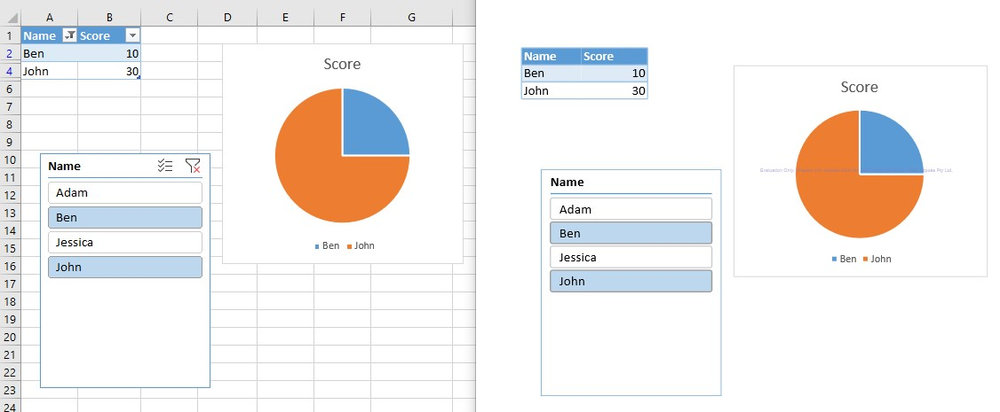

## **How to Draw Slicer while rendering Excel to PDF Using Aspose.Cells for Python Excel Library**
If you have an Excel file which has slicer applied to it and you want to export the Excel to PDF with the slicer settings, Aspose.Cells for Python via .NET now supports this by default. You simply export the Excel file with slicer to PDF, the generated PDF will show the slicer applied.

The following sample code loads the [sample Excel file](94044165.xlsx) that contains an existing slicer. It then saves the workbook as [output PDF file](94044166.pdf). The following screenshot compares the source Excel file and the generated PDF file.

## **Sample Code**

