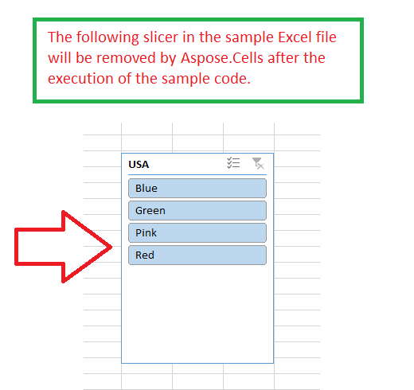

## **Possible Usage Scenarios**

If you want to remove slicer in Microsoft Excel, just select it and press the *Delete* button. Similarly, if you want to remove it using Aspose.Cells for Python via .NET API programmatically, please use the [**Worksheet.slicers.remove()**](https://reference.aspose.com/cells/python-net/aspose.cells.slicers/slicercollection/) method. It will remove the slicer from the worksheet.

## **Removing Slicer**

The following sample code loads the [sample Excel file](67338478.xlsx) that contains an existing slicer. It accesses the slicers and then removes it. Finally, it saves the workbook as [output Excel file](67338477.xlsx). The following screenshot shows the slicer that will be removed after the execution of the sample code.

## **Sample Code**


