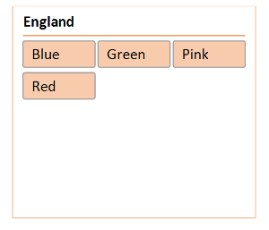

## **Possible Usage Scenarios**
Aspose.Cells for Python via .NET supports the rendering of slicer shapes. If you convert your worksheet into an image or save your workbook to PDF or HTML formats, you will see that slicers are rendered properly.

## **How to Render Slicer Using Aspose.Cells for Python Excel Library**
The following sample code loads the [sample Excel file](67338479.xlsx) that contains an existing slicer. It converts the worksheet into an image by setting the print area that covers only the slicer. The following image is the [output image](67338480.png) that shows the rendered slicer. As you can see, the slicer has been rendered properly and it looks the same as in the sample Excel file.

## **Sample Code**


