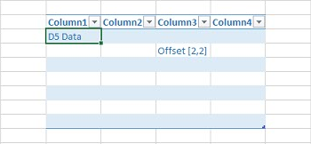

{}

Normally, you add values inside the Table or List Object using [**Cell.put_value()**](https://reference.aspose.com/cells/python-net/aspose.cells/cell/put_value/#bool) method. However, sometimes you might need to add values inside the Table or List Object using row and column offsets.

In order to access a Table or List Object from a cell, use the [**Cell.get_table()**](https://reference.aspose.com/cells/python-net/aspose.cells/cell/get_table/#) method. To add values inside it using the row and column offsets, use the [**ListObject.put_cell_value**](https://reference.aspose.com/cells/python-net/aspose.cells.tables/listobject/put_cell_value/#int-int-any) method.

{}

The following screenshot shows the source Excel file used in the code. It contains an empty table and highlights cell D5, which lies inside the table. We will access this table from cell D5 using the [**Cell.get_table()**](https://reference.aspose.com/cells/python-net/aspose.cells/cell/get_table/#) method and then add values inside it using both [**Cell.put_value()**](https://reference.aspose.com/cells/python-net/aspose.cells/cell/put_value/#bool) and [**ListObject.put_cell_value**](https://reference.aspose.com/cells/python-net/aspose.cells.tables/listobject/put_cell_value/#int-int-any) methods.

## Example

### Screenshots comparing the source and output files

||
| :- |

The following screenshot shows the output Excel file generated by the code. As you can see, cell D5 has a value, and cell F6, which is at the offset (2, 2) of the table, also has a value.

||
| :- |

### Python code to access table from cell and to add values inside it using row and column offsets

The following sample code loads the source Excel file shown above, adds values inside the table, and generates the output Excel file shown above.



