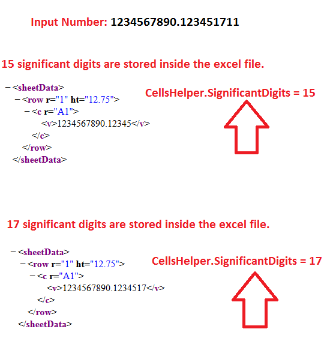

## **Possible Usage Scenarios**

By default, Aspose.Cells stores 17 significant digits of double values inside the Excel file, unlike MS-Excel which stores only 15 significant digits. You can change this behavior from 17 to 15 significant digits using the [**CellsHelper.significant_digits**](https://reference.aspose.com/cells/python-net/aspose.cells/cellshelper/significant_digits/) attribute.

## **Specifying Significant Digits to be stored in Excel file**

The following sample code enforces Aspose.Cells to use 15 significant digits while storing double values. Check the [output excel file](22774105.xlsx) (change extension to .zip to inspect stored values). The screenshot below shows how this setting affects stored values:



## **Sample Code**

```python
from aspose.cells import Workbook, CellsHelper
import aspose.cells
import os
import pytest

# Set significant digits to 15
CellsHelper.set_significant_digits(15)

# Create new workbook
workbook = Workbook()

# Access first worksheet
worksheet = workbook.worksheets[0]

# Set value with extended precision
cell = worksheet.cells.get("A1")
cell.put_value(1234567890123456.001234567890123456)

# Save modified workbook
workbook.save("output.xlsx")
```

```python
import os
from aspose.cells import Workbook, CellsHelper

# The path to the documents directory.
current_dir = os.path.dirname(os.path.abspath(__file__))
data_dir = os.path.join(current_dir, "data")

# Set significant digits to 15 like MS-Excel
CellsHelper.set_significant_digits(15)

# Create workbook
workbook = Workbook()

# Access first worksheet
worksheet = workbook.worksheets[0]

# Access cell A1
c = worksheet.cells.get("A1")

# Put double value with 15 significant digits
c.put_value(1234567890.123451711)

# Save the workbook
output_dir = os.path.join(current_dir, "output")
if not os.path.exists(output_dir):
    os.makedirs(output_dir)

workbook.save(os.path.join(output_dir, "out_SignificantDigits.xlsx"))
```