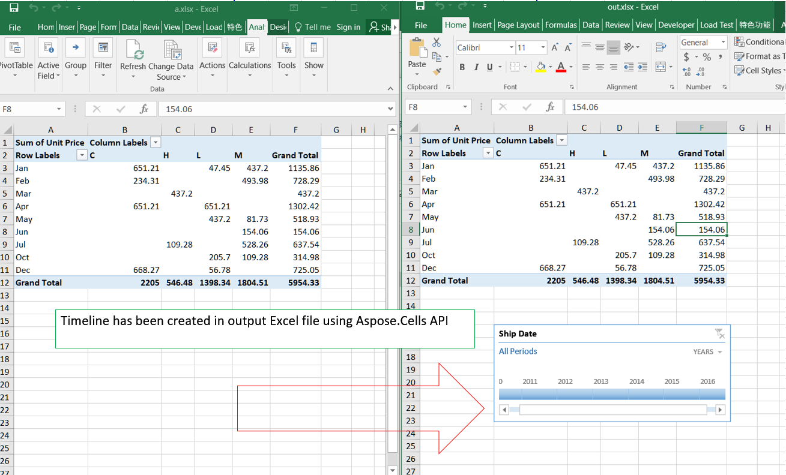

---  
title: Insert Timeline  
linktitle: Timelines  
type: docs  
weight: 170  
url: /python-net/create-timeline/  
description: Learn how to create a timeline with Aspose.Cells for Python via .NET.  
keywords: Aspose.Cells for Python Excel, Excel Python library, Python Create timeline without Excel, Add timeline via Aspose.Cells for Python, Insert timeline using Aspose.Cells for Python.  
ai_search_scope: cells_pythonnet  
ai_search_endpoint: "https://docsearch.api.aspose.cloud/ask" 
---  

## **Possible Usage Scenarios**  

Instead of adjusting filters to show dates, you can use a PivotTable Timeline — a dynamic filter option that lets you easily filter by date/time and zoom in on the period you want with a slider control. Microsoft Excel allows you to create a timeline by selecting a pivot table and then clicking *Insert > Timeline*. Aspose.Cells for Python via .NET also allows you to create a timeline using the [**Worksheet.timelines.add()**](https://reference.aspose.com/cells/python-net/aspose.cells.timelines/timelinecollection/#methods) method.  

## **How to Create a Timeline for a Pivot Table Using Aspose.Cells for Python Excel Library**  

Please see the following sample code. It loads the [sample Excel file](input.xlsx) that contains the pivot table. It then creates the timeline based on the first base pivot field. Finally, it saves the workbook in [output XLSX](output.xlsx) format. The following screenshot shows the timeline created by Aspose.Cells for Python via .NET in the output Excel file.  

  

### **Sample Code**  

  


