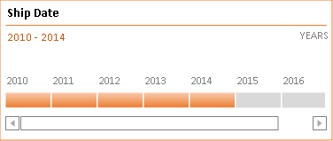

## **Possible Usage Scenarios**
Aspose.Cells for Python via .NET supports the rendering of timeline shape without using office 2013, office 2016, office 2019 and office 365. If you convert your worksheet into an image or you save your workbook to PDF or HTML formats, you will see, timelines are rendered properly.

## **How to Render Timeline Using Aspose.Cells for Python Excel Library**
The following sample code loads the [sample Excel file](input.xlsx) that contains an existing timeline. Get the shape object according to the name of timeline, and then render it into a picture through the Shape.to_image() method. The flowing image is the [output image](out.png) that shows the rendered timeline. As you can see, timeline has been rendered properly and it looks the same as in the sample Excel file.

### **Sample Code**


