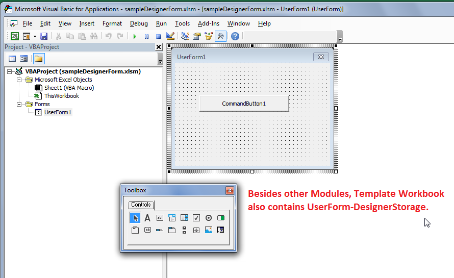
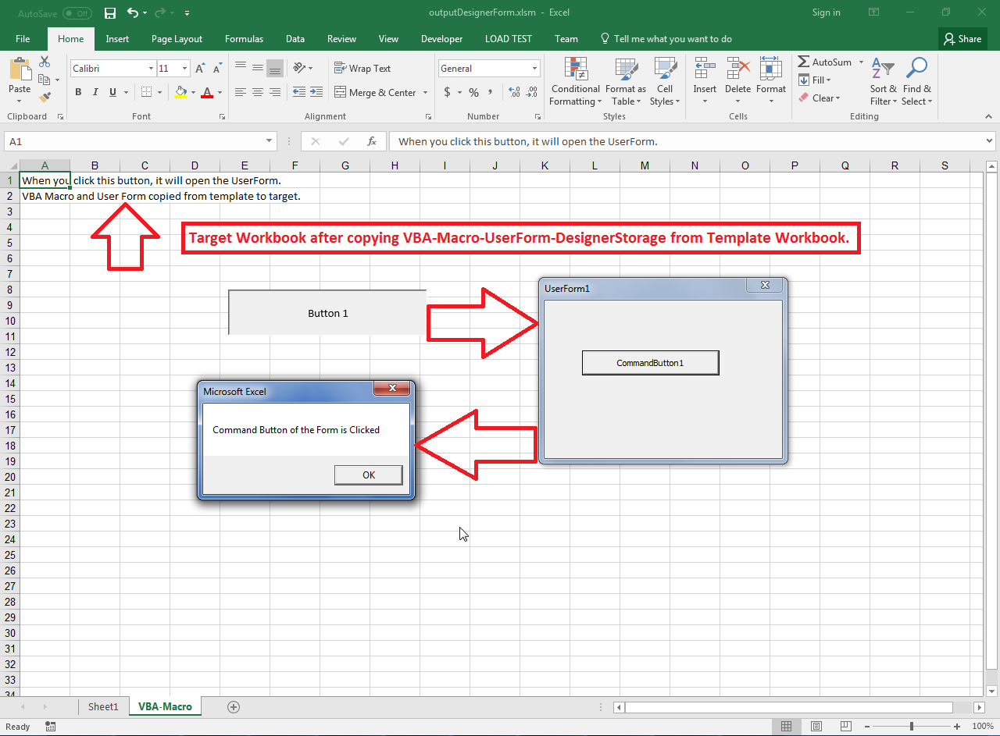

## **Possible Usage Scenarios**

Aspose.Cells for Python via .NET allows you to copy a VBA project from one Excel file into another Excel file. VBA project consists of various types of modules i.e. Document, Procedural, Designer, etc. All modules can be copied with simple code but for the Designer module, there is some extra data called Designer Storage that needs to be accessed or copied. The following two methods deal with Designer Storage.

- [**VbaModuleCollection.get_designer_storage()**](https://reference.aspose.com/cells/python-net/aspose.cells.vba/vbamodulecollection/get_designer_storage/#str)
- [**VbaModuleCollection.add_designer_storage()**](https://reference.aspose.com/cells/python-net/aspose.cells.vba/vbamodulecollection/add_designer_storage/)

## **Copy VBA Macro UserForm DesignerStorage from Template to Target Workbook**

Please see the following sample code. It copies the VBA project from the [template Excel file](50528345.xlsm) into an empty workbook and saves it as the [output Excel file](50528346.xlsm). If you open the VBA project inside the template Excel file, you will see a User Form as shown below. The User Form consists of Designer Storage, so it will be copied using [**VbaModuleCollection.get_designer_storage()**](https://reference.aspose.com/cells/python-net/aspose.cells.vba/vbamodulecollection/get_designer_storage/#str) and [**VbaModuleCollection.add_designer_storage()**](https://reference.aspose.com/cells/python-net/aspose.cells.vba/vbamodulecollection/add_designer_storage) methods.

****

The following screenshot shows the output Excel file and its contents which were copied from the template Excel file. When you click on the Button 1, it opens up the VBA User Form which itself has a command button that shows a message box on clicking.

****

## **Sample Code**




