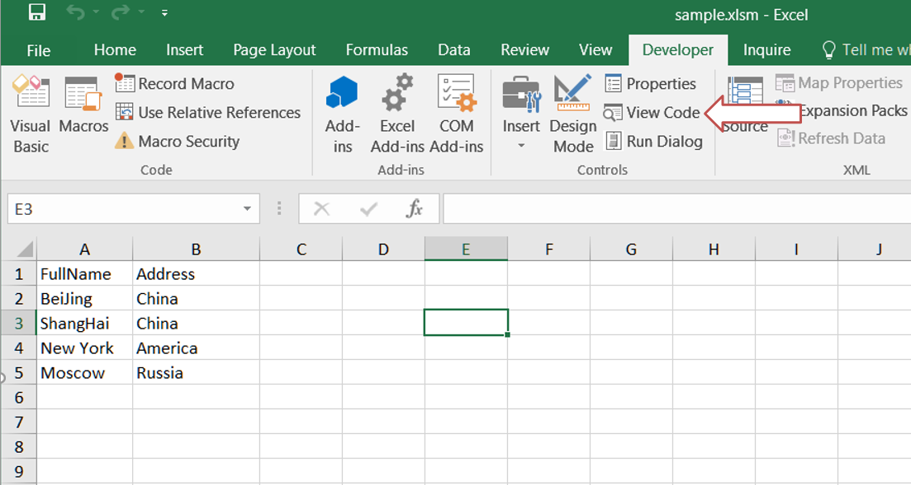
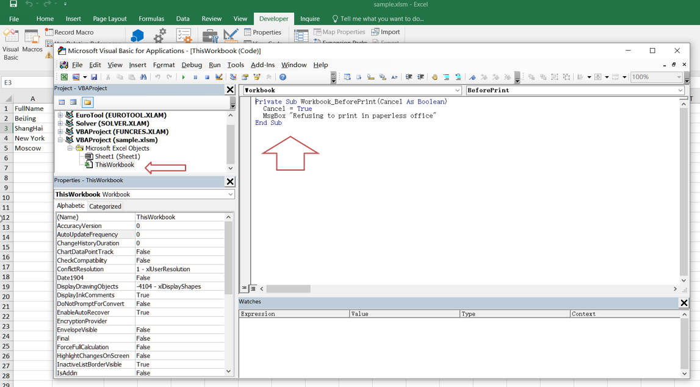

## **Possible Usage Scenarios**
In our daily work, there may be some important information in the Excel file. In order to protect internal data from being exposed, the company will not allow it to be printed. This document will tell you how to prevent others from printing Excel files.

## **How to Prevent Users from Printing a File in MS‑Excel**
You can apply the following VBA code to prevent your specific file from being printed.

1. Open the workbook that you do not want others to print.  
2. Select the **Developer** tab in the Excel ribbon and click the **View Code** button in the **Controls** section. Alternatively, you can press **ALT+F11** to open the Microsoft Visual Basic for Applications window.  
    
   
3. Then, in the Project Explorer on the left, double‑click **ThisWorkbook** to open the module and add some VBA code.  
    
   
4. Save and close the code, then return to the workbook. Now, when you attempt to print the file, it will not be allowed, and you will see the following warning box:  
    
   

## **How to Prevent Users from Printing Excel File using Aspose.Cells for Python via .NET**

The following sample code illustrates how to prevent users from printing an Excel file:

1. Load the [sample file](sample.xlsx).  
2. Get the `VbaModuleCollection` object from the `VbaProject` property of the workbook.  
3. Get the `VbaModule` object via the **ThisWorkbook** name.  
4. Set the `Code` property of the `VbaModule`.  
5. Save the sample file in [XLSM format](out.xlsm).




