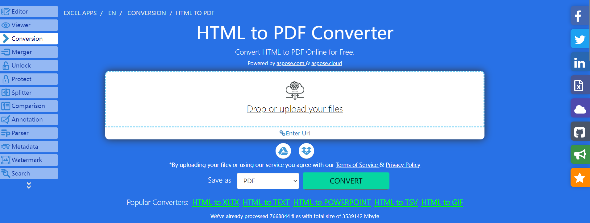

## **Overview**
<b>Aspose.Cells for Python via NET</b> is a professional solution that allows you to generate PDF files from web pages and raw HTML code in your applications. 

This article explains how to <b>convert HTML to PDF</b>. It covers the following topics.

<ul>
<li><a href="#python-convert-html-to-pdf">Python via NET HTML to PDF</a></li>
<li><a href="#python-convert-html-to-pdf">Python via NET Convert HTML to PDF</a></li>
<li><a href="#python-convert-html-to-pdf">Python via NET How to convert HTML to PDF</a></li>
</ul>

## **HTML to PDF Conversion in Python**
How to convert HTML to PDF? With [Aspose.Cells for Python via NET](https://pypi.org/project/aspose-cells-python/) library, you can easily convert HTML to PDF programmatically with a few lines of code. Aspose.Cells for Python via NET is capable of building cross‑platform applications with the ability to generate, modify, convert, render and print all Excel files.

## **Python Convert HTML to PDF**
The following C# code sample shows how to convert an HTML document to a PDF using [Aspose.Cells for Python via NET](https://pypi.org/project/aspose-cells-python/).

1. Create an instance of the [HtmlLoadOptions](https://reference.aspose.com/cells/python-net/aspose.cells/htmlloadoptions/) class.  
2. Initialize a [Workbook](https://reference.aspose.com/cells/python-net/aspose.cells/workbook/) object.  
3. Save the output PDF document by calling the `Workbook.save()` method.



## **Try to convert HTML to PDF online**

[Aspose.Cells for Python via NET](https://pypi.org/project/aspose-cells-python/) presents an online free application <a href="https://products.aspose.app/cells/en/conversion/html-to-pdf">“HTML to PDF”</a>, where you can try the functionality and see the quality it delivers.  
 


