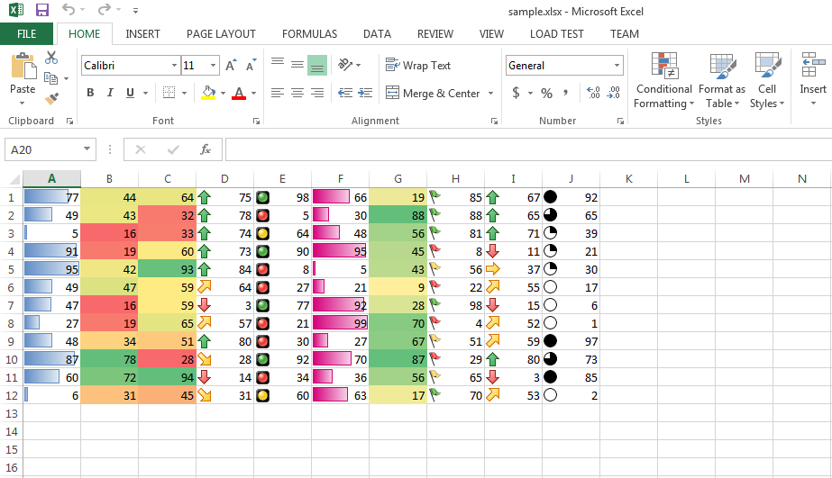

{} 

You can export DataBar, ColorScale and IconSet Conditional Formatting while converting your Excel file into HTML. This feature is partially supported by Microsoft Excel but Aspose.Cells for Python via .NET supports it fully.

{} 

## **Export DataBar, ColorScale and IconSet Conditional Formatting while Excel to HTML Conversion**
The following screenshot shows the [sample excel file](5115558.xlsx) with DataBar, ColorScale and IconSet Conditional Formatting. You can download the [sample excel file](5115558.xlsx) from the given link.

The following screenshot shows the Aspose.Cells output HTML file showing DataBar, ColorScale and IconSet Conditional Formatting. As you can see, it looks exactly like [sample excel file](5115558.xlsx).

### **Sample Code**
The following sample code converts the sample excel file into HTML which is just a normal [Excel to HTML conversion](/cells/python-net/convert-workbook-to-different-formats/#convertworkbooktodifferentformats-convertingexcelworkbooktohtml).




