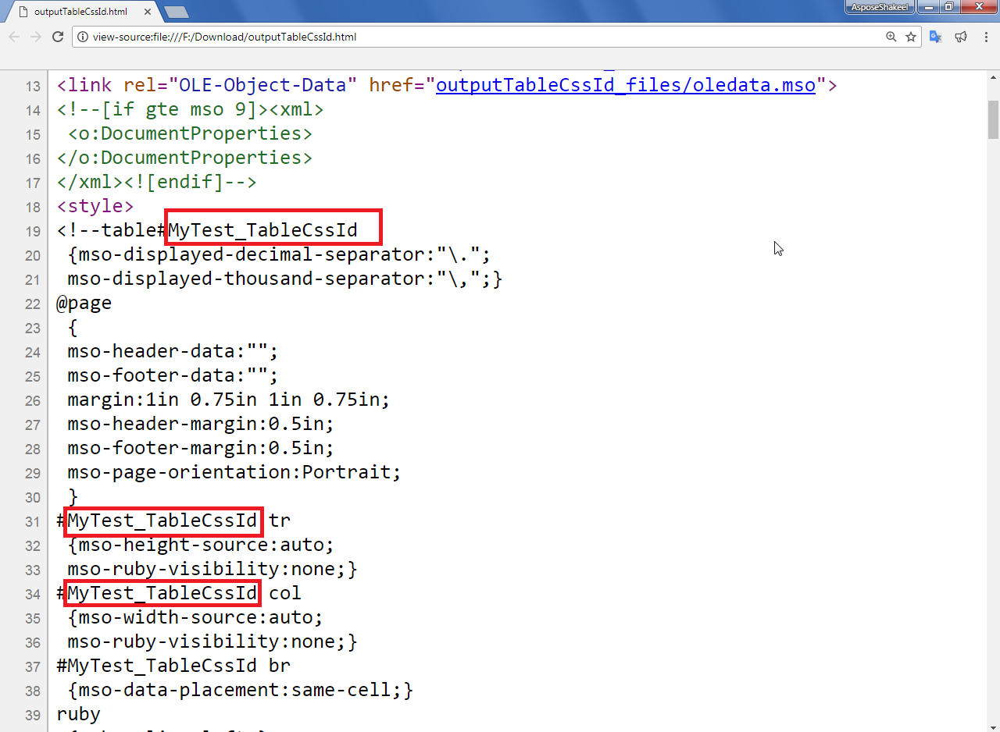

## **Possible Usage Scenarios**

Aspose.Cells allows you to prefix table elements styles with [**HtmlSaveOptions.table_css_id**](https://reference.aspose.com/cells/python-net/aspose.cells/htmlsaveoptions/table_css_id) property. Suppose, you set this property with some value like **MyTest_TableCssId**, then you will find table elements styles like shown below



 table#MyTest_TableCssId

#MyTest_TableCssId tr

#MyTest_TableCssId col

#MyTest_TableCssId br

etc.



The following screenshot shows the effect of using [**HtmlSaveOptions.table_css_id**](https://reference.aspose.com/cells/python-net/aspose.cells/htmlsaveoptions/table_css_id) property on output HTML.

## **Prefix Table Elements Styles with HtmlSaveOptions.TableCssId property**

The following sample code demonstrates how to make use of [**HtmlSaveOptions.table_css_id**](https://reference.aspose.com/cells/python-net/aspose.cells/htmlsaveoptions/table_css_id) property. Please check the [output HTML](60489790.zip) generated by the code for a reference.

## **Sample Code**


