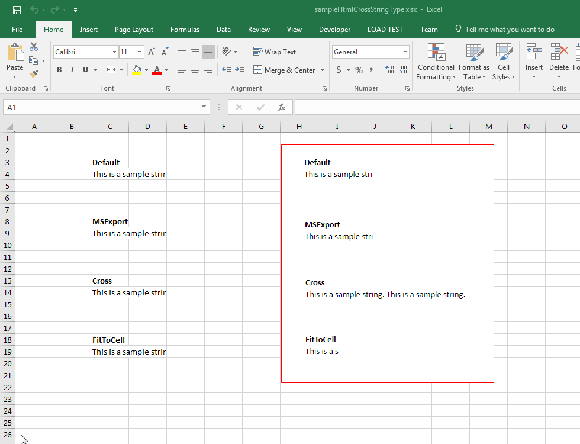

## **Possible Usage Scenarios**

When a cell contains text or a string that is larger than the width of the cell, the string overflows if the next cell in the next column is null or empty. When you save your Excel file into HTML, you can control this overflow by specifying the cross type using the [**HtmlCrossType**](https://reference.aspose.com/cells/python-net/aspose.cells/htmlcrosstype) enumeration. It has the following values:

- **HtmlCrossType.DEFAULT**: Display like MS Excel, depending on the next cell. If the next cell is null, the string will cross; otherwise it will be truncated.

- **HtmlCrossType.MS_EXPORT**: Display the string as MS Excel does when exporting to HTML.

- **HtmlCrossType.CROSS**: Display an HTML cross string; performance for creating large HTML files is more than ten times faster than using the Default or FitToCell values.

- **HtmlCrossType.CROSS_HIDE_RIGHT**: Display an HTML cross string and hide the right part of the string when the texts overlap.

- **HtmlCrossType.FIT_TO_CELL**: Displays the string only within the width of the cell.

## **Specify how to cross string in output HTML using HtmlCrossType**

The following sample code loads the [sample Excel file](51740732.xlsx) and saves it to HTML format by specifying different [**HtmlCrossType**](https://reference.aspose.com/cells/python-net/aspose.cells/htmlcrosstype). Please download the [output HTMLs](51740734.zip) generated with this code. The sample Excel file contains an image bordered in red, as shown in this screenshot, which demonstrates the effect of the [**HtmlCrossType**](https://reference.aspose.com/cells/python-net/aspose.cells/htmlcrosstype) values on the output HTML.

## **Sample Code**



