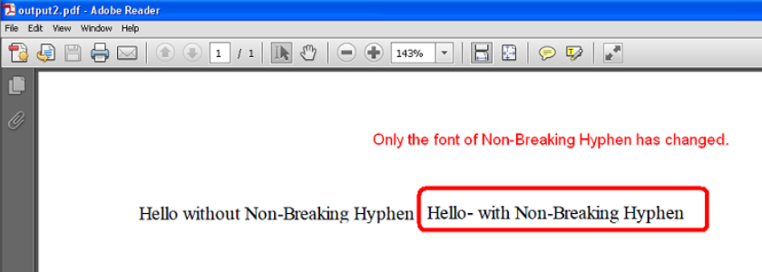

{}

Some Unicode characters are not displayable by user-specified fonts. One such Unicode character is **Non-breaking Hyphen** (U+2011) with Unicode number 8209. This character cannot be displayed with **Times New Roman** but can be shown with fonts like **Arial Unicode MS**.

When such characters appear in text formatted with a specific font (e.g., Times New Roman), Aspose.Cells changes the entire word/sentence's font to a compatible one (e.g., Arial Unicode MS) by default. For users who want only the unrenderable character's font changed, we provide granular control through the **PdfSaveOptions.is_font_substitution_char_granularity** property.

{}

## **Example Comparison**

The screenshots below demonstrate outputs with different settings. The first PDF shows full-text font substitution, while the second PDF changes only the specific character's font.

|**Full Text Substitution**|**Character-Level Substitution**|
| :- | :- |
|||

## **Implementation Steps**

To enable character-level font substitution:

1. Create a [**Workbook**](https://reference.aspose.com/cells/python-net/aspose.cells/workbook/) object
2. Access worksheet cells using [**Worksheet.cells**](https://reference.aspose.com/cells/python-net/aspose.cells/worksheet/cells/) property
3. Set cell values containing special Unicode characters
4. Configure [**PdfSaveOptions**](https://reference.aspose.com/cells/python-net/aspose.cells/pdfsaveoptions/) with:
   - `is_font_substitution_char_granularity = True`
5. Save workbook to PDF format

```python
import os
from aspose.cells import Workbook, PdfSaveOptions

# For complete examples and data files, please go to https://github.com/aspose-cells/Aspose.Cells-for-.NET
current_dir = os.path.dirname(os.path.abspath(__file__))
data_dir = os.path.join(current_dir, "data")

if not os.path.exists(data_dir):
    os.makedirs(data_dir)

# Create workbook object
workbook = Workbook()

# Access the first worksheet
worksheet = workbook.worksheets[0]

# Access cells
cell1 = worksheet.cells.get("A1")
cell2 = worksheet.cells.get("B1")

# Set the styles of both cells to Times New Roman
style = cell1.get_style()
style.font.name = "Times New Roman"
cell1.set_style(style)
cell2.set_style(style)

# Put the values inside the cell
cell1.put_value("Hello without Non-Breaking Hyphen")
cell2.put_value("Hello" + chr(8209) + " with Non-Breaking Hyphen")

# Autofit the columns
worksheet.auto_fit_columns()

# Save to Pdf without setting PdfSaveOptions.is_font_substitution_char_granularity
workbook.save(os.path.join(data_dir, "SampleOutput_out.pdf"))

# Save to Pdf after setting PdfSaveOptions.is_font_substitution_char_granularity to true
opts = PdfSaveOptions()
opts.is_font_substitution_char_granularity = True
workbook.save(os.path.join(data_dir, "SampleOutput2_out.pdf"), opts)
```

## **Key Configuration**

Use these essential API components:

- [**PdfSaveOptions**](https://reference.aspose.com/cells/python-net/aspose.cells/pdfsaveoptions/) class for PDF rendering settings
- **is_font_substitution_char_granularity** property for character-level font substitution
- [**Workbook.save**](https://reference.aspose.com/cells/python-net/aspose.cells/workbook/save/) method for output generation

{} 
**API Difference Note**: In Python.NET, boolean properties use snake_case naming (`is_font_substitution_char_granularity`) instead of PascalCase used in .NET.
{}

