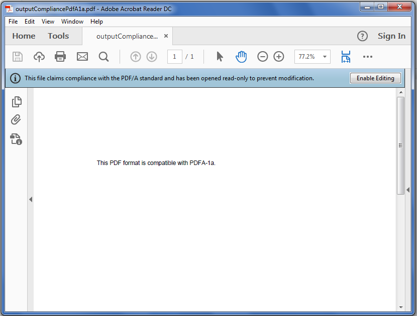

## **Possible Usage Scenarios**

PDF/A is a unique flavor of PDF designed for the long-term preservation of documents. PDF/A is an ISO-standardized version of the Portable Document Format (PDF) which is an archival format of PDF that embeds all fonts used in the document within the PDF file. PDF/A differs from PDF by prohibiting features, such as font linking (as opposed to font embedding) and encryption. Aspose.Cells for Python via .NET enables you to save the Excel files to PDF/A compliant PDF files (both PdfA1a and PdfA1b are supported). This topic describes how to save the Excel workbook to PDF/A compliant (PdfA1a) PDF file.

## **Convert Excel file to PDF Format Compatible with PDFA-1a**

Developers may use the **[PdfSaveOptions](https://reference.aspose.com/cells/python-net/aspose.cells/pdfsaveoptions/)** class to set different attributes for the conversion. Setting different properties of the **[PdfSaveOptions](https://reference.aspose.com/cells/python-net/aspose.cells/pdfsaveoptions/)** class gives you control over the print, font, security and compression settings for the output PDF. The most important property is **[PdfSaveOptions.compliance](https://reference.aspose.com/cells/python-net/aspose.cells/pdfsaveoptions/compliance/)** that enables you to save the Excel files to PDF/A compliant PDF files.

The following sample code explains how to convert Excel file to PDF format compatible with PDFA-1a. Please see its [output PDF](outputCompliancePdfA1a.pdf) as well as the screenshot for a reference.

## **Screenshot**

## **Sample Code**


