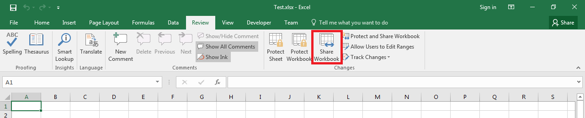

## **Possible Usage Scenarios**

Microsoft Excel allows you to share the workbook as shown in the following screenshot. When you share the workbook, more than one user can edit the workbook on the network. Aspose.Cells for Python via .NET enables you to create a shared workbook with [**Workbook.settings.shared**](https://reference.aspose.com/cells/python-net/aspose.cells/workbooksettings/shared) property.

## **Create Shared Workbook with Aspose.Cells for Python via .NET**

The following sample code creates a shared workbook by setting the [**Workbook.settings.shared**](https://reference.aspose.com/cells/python-net/aspose.cells/workbooksettings/shared) property to **true**. When you open the [output Excel file](55541786.xlsx) in Microsoft Excel, you will see **Shared** displayed with the workbook name, as shown in this screenshot.

## **Sample Code**




