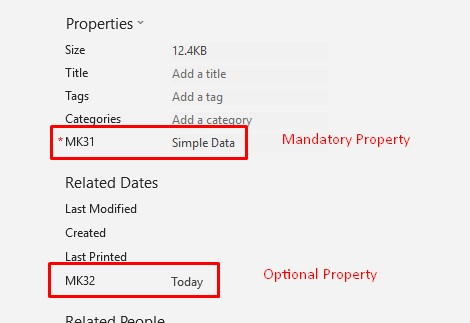

Aspose.Cells for Python via .NET provides [**Workbook.content_type_properties.add()**](https://reference.aspose.com/cells/python-net/aspose.cells.properties/contenttypepropertycollection/add/#str-str) method to add custom ContentTypeProperties to an excel file. You may also make the property optional by setting the [**ContentTypeProperty.is_nillable**](https://reference.aspose.com/cells/python-net/aspose.cells.properties/contenttypeproperty/is_nillable) property to **true**. The following code snippet demonstrates adding optional custom ContentTypeProperties to an excel file. The following image shows both properties that were added by the sample code.

The output file generated by the sample code is attached for reference.

[Output File](95584314.xlsx)

## **Sample Code**



