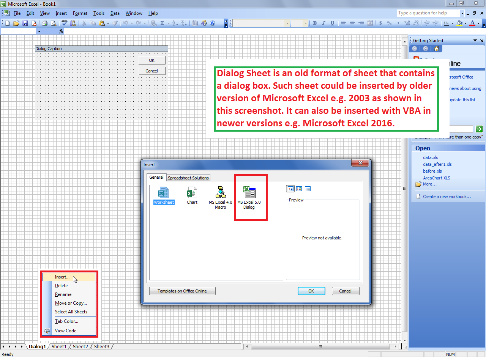

## **Possible Usage Scenarios**

Dialog Sheet is an old sheet format that contains a dialog box. Such a sheet could be inserted by an older version of Microsoft Excel, e.g., 2003, as shown in this screenshot. It can also be inserted with VBA in newer versions, e.g., Microsoft Excel 2016.

You can find out if the sheet is a dialog sheet or some other type of sheet with **[Worksheet.type](https://reference.aspose.com/cells/python-net/aspose.cells/worksheet/type/)**, a property provided by Aspose.Cells for Python via .NET. If it returns the enumeration value **[SheetType.DIALOG](https://reference.aspose.com/cells/python-net/aspose.cells/sheettype/)**, then it means you are dealing with a dialog sheet.

## **Find if the Worksheet is Dialog Sheet**

The following sample code loads the [sample Excel file](64716820.xlsx) that contains a dialog sheet. It checks the **Worksheet.type** property, compares it with **SheetType.DIALOG**, and then prints the message. Please see the console output of the sample code given below for more help.

## **Sample Code**



## **Console Output**



Worksheet is a Dialog Sheet.



