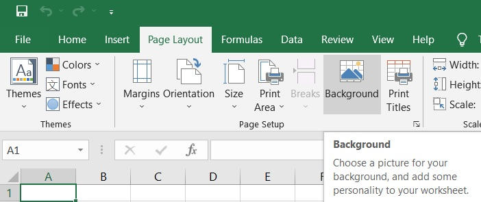

{} 

You can make a worksheet more appealing by adding a picture as a worksheet background. This feature can be quite effective if you have a special corporate graphic that adds a hint of the background without obscuring the data on the sheet. You can set background picture for a sheet using Aspose.Cells for Python via .NET API.

{} 

## **How to Sett Sheet Background in Microsoft Excel**

To set a sheet's background image in Microsoft Excel (for example, Microsoft Excel 2019):

1. From the **Page Layout** menu, find the **Page Setup** option, and then click the **Background** option.
1. Select a picture to set the sheet's background picture.

   **Setting a sheet background**

## **How to Set Sheet Background with Aspose.Cells for Python Excel Library**

The code below sets a background image using an image from a stream.




