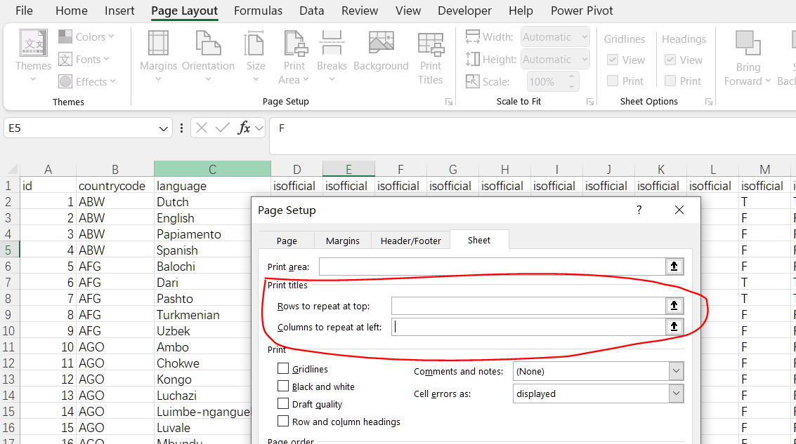
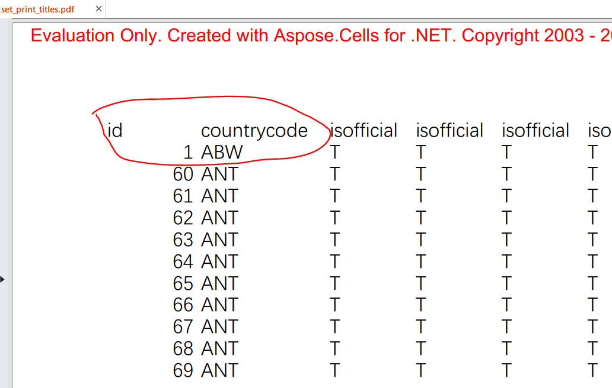

---  
title: Set Print Titles with Python.NET  
linktitle: Set Print Titles  
type: docs  
weight: 200  
url: /python-net/how-to-set-print-titles/  
description: Learn how to configure repeated row/column headers on printed pages using Aspose.Cells for Python via .NET.  
keywords: Python repeat print headers, Python set print titles, Python clear print titles, Excel page setup Python, Python.NET spreadsheet printing  
ai_search_scope: cells_pythonnet  
ai_search_endpoint: "https://docsearch.api.aspose.cloud/ask" 
---  

## **Possible Usage Scenarios**  

Setting print titles in Excel ensures that specific rows or columns are repeated on every printed page, which is especially useful for large spreadsheets that span multiple pages. Here are some reasons to set print titles:  

1. **Enhanced Readability:** Print titles help readers understand the data by keeping headers visible on all pages, making it easier to interpret the information on each page without having to refer back to the first page.  

2. **Professional Presentation:** Consistently displaying headers or labels on each page creates a more polished and professional appearance for printed documents.  

3. **Improved Navigation:** For documents with extensive data, repeating the headers on each page allows for quicker navigation and reference, reducing the need to flip back and forth between pages.  

4. **Reduced Errors:** When headers are present on every page, they minimize the chances of misinterpretation or data‑entry errors, as users can easily see the context of the data.  

5. **Consistency:** Ensuring that important information, such as column headers or row labels, is always visible maintains consistency and clarity throughout the document.  

## **How to Set Print Titles in Excel**  

To set print titles in Excel, follow these steps:  

1. **Open the Page Layout Tab:** Click on the **Page Layout** tab in the ribbon at the top of the Excel window.  
2. **Access Print Titles:** In the **Page Setup** group, click on **Print Titles**.  
3. **Set Rows to Repeat:** In the **Page Setup** dialog box, go to the **Sheet** tab. In the **Print titles** section, specify the rows to repeat at the top by clicking the box next to *Rows to repeat at top* and selecting the row(s) you want to repeat.  
4. **Set Columns to Repeat (if needed):** Similarly, you can specify the columns to repeat at the left by clicking the box next to *Columns to repeat at left* and selecting the column(s) you want to repeat.  
   <br>  
     
5. **Confirm and Print:** Click **OK** to apply the settings. When you print the worksheet, the specified rows or columns will appear on every printed page.  

## **How to Clear Print Titles in Excel**  

To clear print titles in Excel, remove the rows or columns that are set to repeat on every printed page. Here’s how to do it:  

1. **Open the Page Layout Tab:** Click on the **Page Layout** tab in the ribbon at the top of the Excel window.  
2. **Access Print Titles:** In the **Page Setup** group, click on **Print Titles**.  
3. **Clear Print Titles:** In the **Page Setup** dialog box, go to the **Sheet** tab. Clear the text boxes for *Rows to repeat at top* and *Columns to repeat at left* by deleting any content inside them.  
   <br>  
     
4. **Confirm and Close:** Click **OK** to apply the changes.  

## **How to Set Print Titles Using Aspose.Cells**  

To set print titles in a specified worksheet: first, load the [sample file](input.xlsx), then modify the **Worksheet.page_setup.print_title_rows** and **Worksheet.page_setup.print_title_columns** properties of the **PageSetup** object. Setting these properties to a range string configures the print titles.  

```python
import aspose.cells as ac

# Load sample workbook
workbook = ac.Workbook("input.xlsx")

# Access first worksheet
worksheet = workbook.worksheets[0]

# Set row 1 as repeating header
worksheet.page_setup.print_title_rows = "$1:$1"

# Save modified workbook
workbook.save("output.xlsx")
```  

The output result:  
<br>  
  

## **How to Clear Print Titles Using Aspose.Cells**  

To clear print titles, set the print‑title properties to empty strings:  

```python
import aspose.cells as ac

# Load sample workbook
workbook = ac.Workbook("input.xlsx")

# Access first worksheet
worksheet = workbook.worksheets[0]

# Clear existing print titles
worksheet.page_setup.print_title_rows = ""
worksheet.page_setup.print_title_columns = ""

# Save modified workbook
workbook.save("output.xlsx")
```  

The output result:  
<br>  
  

```python
from aspose.cells import Workbook

# Load the workbook
workbook = Workbook("input.xlsx")

# Access the desired worksheet
worksheet = workbook.worksheets[0]

# Set rows to repeat at the top (e.g., rows 1 and 2)
worksheet.page_setup.print_title_rows = "$1:$2"

# Set columns to repeat at the left (e.g., columns A and B)
worksheet.page_setup.print_title_columns = "$A:$B"

# Save the workbook
workbook.save("set_print_titles.pdf")
```  

```python
from aspose.cells import Workbook

# Load the workbook
workbook = Workbook("input.xlsx")

# Access the desired worksheet
worksheet = workbook.worksheets[0]

# Clear the rows and columns set to repeat
worksheet.page_setup.print_title_rows = ""
worksheet.page_setup.print_title_columns = ""

# Save the workbook
workbook.save("clear_print_titles.pdf")
```  


